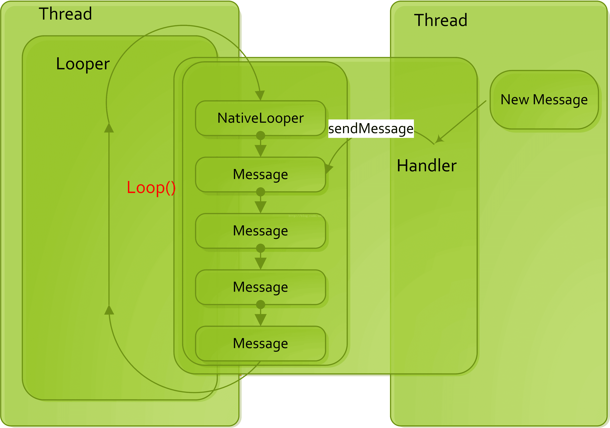

[TOC]

# Handler消息机制

## 前言

`Handler`机制是`Android`提供的消息处理机制。采用的是生产者-消费者模型，`Handler`就是生产者，通过它可以生产需要执行的消息任务放到`MessageQueue`队列中，而`Looper`则是消费者，不断从 `MessageQueue`中取出`Message`并对这些消息进行消费。

## 开始分析

开始分析前先来看一张图（图来自：[Android Handler 机制（三）：Handler 机制与管道 Pipe 机制](https://www.cnblogs.com/renhui/p/12875396.html)）：



该图很直观的体现了**线程间**是如何通过`Handler`机制进行通信的。

### 消息处理机制

首先介绍核心的几个类之间的关系：`Handler`、`Looper`、`MessageQueue`、`Message`。

#### Handler-消息处理器

作为我们接触`Handler`消息机制最常用的类，主要提供了发送、移除和处理`Message`的操作。

首先看下最常用的默认构造函数：

```java
public class Hanlder {
    final Looper mLooper;
    final MessageQueue mQueue;    
    /**
     * Default constructor associates this handler with the {@link Looper} for the
     * current thread.
     *
     * If this thread does not have a looper, this handler won't be able to receive messages
     * so an exception is thrown.
     */
    public Handler() {
        this(null, false);
    }
    
    public Handler(Callback callback, boolean async) {
        if (FIND_POTENTIAL_LEAKS) {
            final Class<? extends Handler> klass = getClass();
            if ((klass.isAnonymousClass() || klass.isMemberClass() || klass.isLocalClass()) &&
                    (klass.getModifiers() & Modifier.STATIC) == 0) {
                Log.w(TAG, "The following Handler class should be static or leaks might occur: " +
                    klass.getCanonicalName());
            }
        }

        mLooper = Looper.myLooper(); // 获取当前线程Looper，细节下文分析
        if (mLooper == null) {
            throw new RuntimeException(
                "Can't create handler inside thread " + Thread.currentThread()
                        + " that has not called Looper.prepare()");
        }
        mQueue = mLooper.mQueue; // 获取Looper对应的MessageQueue
        mCallback = callback;
        mAsynchronous = async;
    }
}
```

内容很简单，核心部分是赋值`mLooper`和`mQueue`。

我们平时使用`Handler`发送消息的函数，最终都会走到`enqueueMessage()`：

```java
public class Handler {
    
    private boolean enqueueMessage(MessageQueue queue, Message msg, long uptimeMillis) {
        msg.target = this; // msg.target设置为当前handler
        if (mAsynchronous) { // 当前为异步Handler，所有消息都标记为异步，直到api28才有开放对应的创建异步Handler函数，暂不考虑
            msg.setAsynchronous(true);
        }
        return queue.enqueueMessage(msg, uptimeMillis); // 入队
    }
}
```

核心流程：

1. `msg.target`设置为当前`handler`
2. 调用`queue.enqueueMessage`入队

消息入队后就等待处理被触发，我们经常会去重写`handlerMessage`来处理消息，根据调用能找到被`dispatchMessage()`调用：

```java
public class Handler {
    /**
     * Subclasses must implement this to receive messages.
     */
    public void handleMessage(Message msg) {
    }
    
    /**
     * Handle system messages here.
     */
    public void dispatchMessage(Message msg) {
        if (msg.callback != null) { // 如果消息设置了callback，执行callback的run函数
            handleCallback(msg);
        } else {
            if (mCallback != null) { // 创建Handler设置了mCallback，回调mCallback的handleMessage
                if (mCallback.handleMessage(msg)) { // 返回true流程结束
                    return;
                }
            }
            handleMessage(msg); // 调用handleMessage处理
        }
    }
}
```

`dispatchMessage()`的调用在下文的`Looper.loop()`中会分析到。

#### Looper-轮询器

`Looper`的构造函数是私有的，我们使用时只能通过`prepare()`函数来创建实例对象：

```java
public final class Looper {
    
    // sThreadLocal.get() will return null unless you've called prepare().
    static final ThreadLocal<Looper> sThreadLocal = new ThreadLocal<Looper>();
    private static Looper sMainLooper;  // guarded by Looper.class

    final MessageQueue mQueue;
    
    private Looper(boolean quitAllowed) {
        mQueue = new MessageQueue(quitAllowed); // 创建消息队列：MesssageQueue
        mThread = Thread.currentThread(); // 获取当前线程的引用
    }
    
    /** Initialize the current thread as a looper.
      * This gives you a chance to create handlers that then reference
      * this looper, before actually starting the loop. Be sure to call
      * {@link #loop()} after calling this method, and end it by calling
      * {@link #quit()}.
      */
    public static void prepare() {
        prepare(true);
    }

    private static void prepare(boolean quitAllowed) {
        if (sThreadLocal.get() != null) {
            throw new RuntimeException("Only one Looper may be created per thread");
        }
        sThreadLocal.set(new Looper(quitAllowed)); // 保存创建的Looper到当前线程
    }

    /**
     * Initialize the current thread as a looper, marking it as an
     * application's main looper. The main looper for your application
     * is created by the Android environment, so you should never need
     * to call this function yourself.  See also: {@link #prepare()}
     */
    public static void prepareMainLooper() {
        prepare(false); // 主线程也是调用prepare方法
        synchronized (Looper.class) {
            if (sMainLooper != null) {
                throw new IllegalStateException("The main Looper has already been prepared.");
            }
            sMainLooper = myLooper();
        }
    }
}
```

可以得到以下几个结论：

- 每个`Looper`实例对应一个消息队列`MessageQueue`实例
- 每条线程只能创建一个`Looper`对象，并被保存在`ThreadLocal`中
- `prepare()`在调用线程中只能调用一次，多次调用将抛出异常
- `prepare()`调用要在创建`Handler`实例之前调用
- 可以引申出另一个结论：每个Handler对象只能关联一条线程，多个不同的Handler对象可以关联同一条线程，共用`Looper`对象和`MessageQueue`对象

既然叫轮询器，就应该有轮询的函数，而且实现上可以猜测应该是个死循环来不断轮询，接下来看`Looper`的轮询函数`loop()`：

```java
public final class Looper {
    /**
     * Run the message queue in this thread. Be sure to call
     * {@link #quit()} to end the loop.
     */
    public static void loop() {
        final Looper me = myLooper(); // 获取当前线程对应的looper对象
        if (me == null) {
            throw new RuntimeException("No Looper; Looper.prepare() wasn't called on this thread.");
        }
        final MessageQueue queue = me.mQueue; // 获取消息队列

        ...

        for (;;) { // 死循环
            Message msg = queue.next(); // 从消息队列取出要处理的消息，细节下文分析
            if (msg == null) { // msg为null表示消息队列正在退出
                // No message indicates that the message queue is quitting.
                return; // 结束死循环，将执行Looper.loop()后续的代码
            }

            // This must be in a local variable, in case a UI event sets the logger
            final Printer logging = me.mLogging;
            if (logging != null) { // 如果logging对象不为空，调用输出日志
                logging.println(">>>>> Dispatching to " + msg.target + " " +
                        msg.callback + ": " + msg.what);
            }

            ...
            try {
                msg.target.dispatchMessage(msg); // msg.target为发送消息对应的Handler，调用dispatchMessage分发消息
                ...
            } finally {
                ...
            }
            ...

            if (logging != null) { // 输出处理结束
                logging.println("<<<<< Finished to " + msg.target + " " + msg.callback);
            }

            ...

            msg.recycleUnchecked(); // 回收使用后的消息，如果消息池没达到上限，放入消息池
        }
    }
}
```

核心流程为：

1. 开启死循环
2. 调用`queue.next()`从`MessageQueue`取出当前时刻要处理的消息，如果没有满足条件的消息，内部进行阻塞
3. 调用`msg.target.dispatchMessage(msg)`，让消息对应的发送者`Handler`执行`dispatchMessage()`
4. 消息处理后回收，继续执行2
5. 如果`queue.next()`返回`null`，将结束死循环，将执行`Looper.loop()`后续的代码

> 注意到`logging`这个`Printer`对象，在消息处理前和处理后都执行一次，`BlockCanary`原理就是通过该方式来找出主线程的耗时操作。

以上结论就解释了为什么我们在子线程使用`Handler`时的标准姿势是这样的了：

```java
class LooperThread extends Thread {
    public Handler mHandler; // 定义成员变量，然后让其它线程可以调用实现线程间通讯

    public void run() {
        Looper.prepare(); // 创建当前线程的Looper实例

        mHandler = new Handler() {
            public void handleMessage(Message msg) {
                // process incoming messages here
            }
        };

        Looper.loop(); // 进入死循环
    }
}
```

> `HandlerThread`提供了创建子线程并使用`Looper`的封装。

#### MessageQueue-消息队列

消息队列，核心功能是提供消息入队、出队。

入队函数只有`enqueueMessage()`和`postSyncBarrier()`，`postSyncBarrier()`是发送同步屏障，在下文中单独介绍，先来看`enqueueMessage()`实现：

```java
public final class MessageQueue {
    
    boolean enqueueMessage(Message msg, long when) {
        if (msg.target == null) {
            throw new IllegalArgumentException("Message must have a target.");
        }
        if (msg.isInUse()) {
            throw new IllegalStateException(msg + " This message is already in use.");
        }

        synchronized (this) {
            if (mQuitting) {
                IllegalStateException e = new IllegalStateException(
                        msg.target + " sending message to a Handler on a dead thread");
                Log.w(TAG, e.getMessage(), e);
                msg.recycle();
                return false;
            }

            msg.markInUse();
            msg.when = when;
            Message p = mMessages;
            boolean needWake;
            if (p == null || when == 0 || when < p.when) { // 当前没有消息，或消息时间比当前队头小
                // New head, wake up the event queue if blocked.
                msg.next = p;
                mMessages = msg; // 添加到队头
                needWake = mBlocked; // 如果当前阻塞，设置需要唤醒
            } else {
                // Inserted within the middle of the queue.  Usually we don't have to wake
                // up the event queue unless there is a barrier at the head of the queue
                // and the message is the earliest asynchronous message in the queue.
                needWake = mBlocked && p.target == null && msg.isAsynchronous(); // 如果当前阻塞且队头为同步屏障且新增的消息为异步消息
                Message prev;
                for (;;) {
                    prev = p;
                    p = p.next;
                    if (p == null || when < p.when) { // 遍历消息队列，找到合适的位置
                        break;
                    }
                    if (needWake && p.isAsynchronous()) { // 如果队列中存在比新增消息执行时间早的异步消息，不需要唤醒
                        needWake = false;
                    }
                }
                msg.next = p; // invariant: p == prev.next
                prev.next = msg; // 消息入队
            }

            // We can assume mPtr != 0 because mQuitting is false.
            if (needWake) {
                nativeWake(mPtr); // 调用唤醒
            }
        }
        return true;
    }
}
```

主要分两种情况：

1. 消息队列无消息，直接把新增消息添加到队头

    唤醒条件为：当前为阻塞状态

2. 消息队列存在消息，根据设置的执行时间，找到合适的位置插入新增的消息

    唤醒条件为：当前为阻塞状态，且当前队列头部消息为同步屏障，且新增的消息为最早执行的异步消息

出队操作提供了多个`removeXxx()`函数，我们找比较常用到的`removeCallbacksAndMessages()`分析：

```java
public final class MessageQueue {
    
    void removeCallbacksAndMessages(Handler h, Object object) {
        if (h == null) {
            return;
        }

        synchronized (this) {
            Message p = mMessages;

            // Remove all messages at front.
            while (p != null && p.target == h
                    && (object == null || p.obj == object)) { // 从队头开始，满足条件就移除，否则退出循环
                Message n = p.next;
                mMessages = n; // 更新队头消息
                p.recycleUnchecked(); // 回收消息
                p = n;
            }

            // Remove all messages after front.
            while (p != null) {
                Message n = p.next; // 取p的下一个，首次循环p肯定不满足条件
                if (n != null) {
                    if (n.target == h && (object == null || n.obj == object)) { // 满足条件移除
                        Message nn = n.next;
                        n.recycleUnchecked();
                        p.next = nn;
                        continue; // 移除后重新开始
                    }
                }
                p = n; // 当前n不满足条件，更新p
            } 
        }
    }
}
```

出队操作的总结为：

1. 从队头`mMessages`开始，找到满足条件的消息移除，并更新队头`mMessages`，直到没有满足条件的消息退出循环；
2. 从1退出循环的消息开始，移除所有满足条件的消息

从上文`Looper`的`loop()`分析中我们知道，`MessageQueue`有一个获取执行消息的函数`next()`，该函数即实现了获取当下需要被执行的消息，也提供了阻塞的机制：

```java
public final class MessageQueue {
    
    Message next() {
        // Return here if the message loop has already quit and been disposed.
        // This can happen if the application tries to restart a looper after quit
        // which is not supported.
        final long ptr = mPtr;
        if (ptr == 0) {
            return null;
        }

        int pendingIdleHandlerCount = -1; // -1 only during first iteration
        int nextPollTimeoutMillis = 0;
        for (;;) { // 进入死循环
            if (nextPollTimeoutMillis != 0) {
                Binder.flushPendingCommands();
            }

            nativePollOnce(ptr, nextPollTimeoutMillis); // 调用底层轮询函数，并设置超时时间，0立即返回，-1表示无限超时需要被主动唤醒，原理是通过epoll机制实现

            synchronized (this) {
                // Try to retrieve the next message.  Return if found.
                final long now = SystemClock.uptimeMillis(); // 获取当前手机启动到目前的毫秒时间（不包含手机休眠时间）
                Message prevMsg = null;
                Message msg = mMessages; // 队头消息
                if (msg != null && msg.target == null) { // 当前队头为同步屏障，在下文同步屏障机制中再详细分析
                    // Stalled by a barrier.  Find the next asynchronous message in the queue.
                    do {
                        prevMsg = msg;
                        msg = msg.next;
                    } while (msg != null && !msg.isAsynchronous());
                }
                if (msg != null) { // 当前有消息
                    if (now < msg.when) { // 当前消息还未到执行时间，计算需要阻塞的时间
                        // Next message is not ready.  Set a timeout to wake up when it is ready.
                        nextPollTimeoutMillis = (int) Math.min(msg.when - now, Integer.MAX_VALUE);
                    } else { // 当前消息满足
                        // Got a message.
                        mBlocked = false; // 标记非阻塞
                        if (prevMsg != null) { // 当前路径为有同步屏障的情况，在下文同步屏障机制中再详细分析
                            prevMsg.next = msg.next;
                        } else {
                            mMessages = msg.next; // 更新队头消息为下一个消息
                        }
                        msg.next = null; // 断开当前消息与队列的关联
                        if (DEBUG) Log.v(TAG, "Returning message: " + msg);
                        msg.markInUse(); // 标记消息正在被使用
                        return msg; // 返回消息，退出循环
                    }
                } else { // 当前无消息
                    // No more messages.
                    nextPollTimeoutMillis = -1; // 超时时间设为-1，表示无限循环
                }

                // Process the quit message now that all pending messages have been handled.
                if (mQuitting) { // 当前已调用退出
                    dispose(); // 调用底层通知销毁
                    return null; // 返回空消息，通知looper退出死循环
                }

                ...忽略空闲处理，空闲机制下文再详细分析
                if (pendingIdleHandlerCount <= 0) { // 没有需要处理的空闲处理器
                    // No idle handlers to run.  Loop and wait some more.
                    mBlocked = true; // 标记阻塞
                    continue; // 继续循环，此时nextPollTimeoutMillis=当前消息等待执行的时常/-1
                }

                ...忽略空闲处理，空闲机制下文再详细分析
            }

            ...忽略空闲处理，空闲机制下文再详细分析
        }
    }
}
```

核心流程：

1. 开启死循环
2. 调用`nativePollOnce(ptr, nextPollTimeoutMillis)` ，调用底层轮询函数，并设置超时时间，-1表示无限超时需要被主动唤醒，底层原理是通过epoll机制实现
3. 判断当前队头消息是否应该在此刻被执行，满足当前队头消息出队，函数返回
4. 当前无消息或队头消息还没到执行时刻，设置`nextPollTimeoutMillis`为-1或队头消息等待执行的时常，标记阻塞状态，继续循环执行2
5. 当外部调用`quit()`把`mQuitting`设为`true`，当前函数会返回`null`结束循环，通知`looper`退出死循环

#### Message-消息载体

定义的消息载体，通过成员变量`target`指向发送的`Handler`对象，通过`next`指向下一个消息，实现单链表结构。

同时，`Message`提供了静态消息池`sPool`，上限是`MAX_POOL_SIZE = 50`，防止频繁的创建消息对象。我们可以通过调用多个重载函数`obtain()`复用已回收的消息对象，最终都会调用无参的`obtain()`函数：

```java
public final class Message implements Parcelable {
    
    private static Message sPool;
    private static int sPoolSize = 0;

    private static final int MAX_POOL_SIZE = 50;

    
    /**
     * Return a new Message instance from the global pool. Allows us to
     * avoid allocating new objects in many cases.
     */
    public static Message obtain() {
        synchronized (sPoolSync) {
            if (sPool != null) {
                Message m = sPool; // 取出消息池首个消息
                sPool = m.next;
                m.next = null;
                m.flags = 0; // clear in-use flag
                sPoolSize--; // 数量减少
                return m;
            }
        }
        return new Message(); // 当前消息池无消息对象，直接创建
    }
}
```

> `sPool`为静态变量，即整个进程共享消息池。

在`Looper`的`loop()`获取消息处理结束后会调用`msg.recycleUnchecked()`：

```java
public final class Message implements Parcelable {
    /**
     * Recycles a Message that may be in-use.
     * Used internally by the MessageQueue and Looper when disposing of queued Messages.
     */
    void recycleUnchecked() {
        // Mark the message as in use while it remains in the recycled object pool.
        // Clear out all other details.
        flags = FLAG_IN_USE;
        what = 0;
        arg1 = 0;
        arg2 = 0;
        obj = null;
        replyTo = null;
        sendingUid = -1;
        when = 0;
        target = null;
        callback = null;
        data = null; // 以上都是清理引用

        synchronized (sPoolSync) {
            if (sPoolSize < MAX_POOL_SIZE) { // 判断消息池是否已满
                next = sPool;
                sPool = this; // 回收的消息放到队头
                sPoolSize++; // 数量加一
            }
        }
    }
}
```

### 同步屏障机制

同步屏障的机制它可以实现同步屏障后的同步消息不执行，异步消息优先执行的功能。我们熟知该机制主要应用在`Android`的界面绘制调度中，保证界面绘制调度消息能够得到优先处理，防止界面掉帧。

> `ViewRootImpl`是界面绘制调度的核心类，将在绘制相关的分析中介绍。

#### 加入同步屏障

同步屏障消息最大的特征就是它的`target`为`null`，且不会被消费，仅仅是作为一个“屏障”处于消息队列`MessageQueue`中。我们可以通过`MessageQueue.postSyncBarrier()`方法将其加入到消息队列：

```java
public final class MessageQueue {
    /**
     * Posts a synchronization barrier to the Looper's message queue.
     *
     * Message processing occurs as usual until the message queue encounters the
     * synchronization barrier that has been posted.  When the barrier is encountered,
     * later synchronous messages in the queue are stalled (prevented from being executed)
     * until the barrier is released by calling {@link #removeSyncBarrier} and specifying
     * the token that identifies the synchronization barrier.
     *
     * This method is used to immediately postpone execution of all subsequently posted
     * synchronous messages until a condition is met that releases the barrier.
     * Asynchronous messages (see {@link Message#isAsynchronous} are exempt from the barrier
     * and continue to be processed as usual.
     *
     * This call must be always matched by a call to {@link #removeSyncBarrier} with
     * the same token to ensure that the message queue resumes normal operation.
     * Otherwise the application will probably hang!
     *
     * @return A token that uniquely identifies the barrier.  This token must be
     * passed to {@link #removeSyncBarrier} to release the barrier.
     *
     * @hide
     */
    public int postSyncBarrier() {
        return postSyncBarrier(SystemClock.uptimeMillis());
    }

    private int postSyncBarrier(long when) {
        // Enqueue a new sync barrier token.
        // We don't need to wake the queue because the purpose of a barrier is to stall it.
        synchronized (this) {
            final int token = mNextBarrierToken++;
            final Message msg = Message.obtain();
            msg.markInUse();
            msg.when = when;
            msg.arg1 = token;

            Message prev = null;
            Message p = mMessages;
            if (when != 0) {
                // 找到合适的位置
                while (p != null && p.when <= when) {
                    prev = p;
                    p = p.next;
                }
            }
            if (prev != null) { // invariant: p == prev.next
                // 找到合适的位置插入同步屏障消息
                msg.next = p;
                prev.next = msg;
            } else {
                // 把同步屏障消息插入到链表头部
                msg.next = p;
                mMessages = msg;
            }
            return token; // 返回token
        }
    }
}
```

对比前面的`enqueueMessage`方法，普通的`enqueue`操作是没有办法在消息队列中放入这样一个`target`为`null`的消息的。因此同步屏障消息只能通过这个方法发出。

> 插入同步屏障消息也遵循按执行时间顺序入队

#### 处理异步消息

接下来分析一下存在同步屏障时，异步消息是如何被优先处理的：

```java
public final class MessageQueue {
    
    Message next() {
        // Return here if the message loop has already quit and been disposed.
        // This can happen if the application tries to restart a looper after quit
        // which is not supported.
        final long ptr = mPtr;
        if (ptr == 0) {
            return null;
        }

        int pendingIdleHandlerCount = -1; // -1 only during first iteration
        int nextPollTimeoutMillis = 0;
        for (;;) {
            if (nextPollTimeoutMillis != 0) {
                Binder.flushPendingCommands();
            }

            nativePollOnce(ptr, nextPollTimeoutMillis);

            synchronized (this) {
                // Try to retrieve the next message.  Return if found.
                final long now = SystemClock.uptimeMillis();
                Message prevMsg = null;
                Message msg = mMessages;
                if (msg != null && msg.target == null) { // 当前消息为同步屏障，寻找在它后面的异步消息
                    // Stalled by a barrier.  Find the next asynchronous message in the queue.
                    do {
                        prevMsg = msg;
                        msg = msg.next;
                    } while (msg != null && !msg.isAsynchronous()); // 如果为同步消息，继续寻找
                }
                if (msg != null) { // 找到异步消息
                    if (now < msg.when) { // 如果异步消息还未到执行时间，计算需要的阻塞时间
                        // Next message is not ready.  Set a timeout to wake up when it is ready.
                        nextPollTimeoutMillis = (int) Math.min(msg.when - now, Integer.MAX_VALUE);
                    } else {
                        // Got a message.
                        mBlocked = false;
                        if (prevMsg != null) { // 同步屏障下走该路径
                            prevMsg.next = msg.next; // 从消息队列中移除异步消息
                        } else {
                            mMessages = msg.next;
                        }
                        msg.next = null;
                        if (DEBUG) Log.v(TAG, "Returning message: " + msg);
                        msg.markInUse();
                        return msg; // 返回异步消息
                    }
                } else { // 没有找到异步消息
                    // No more messages.
                    nextPollTimeoutMillis = -1; // 赋值-1，循环下一次执行nativePollOnce可以进入阻塞状态
                }

                // Process the quit message now that all pending messages have been handled.
                if (mQuitting) {
                    dispose();
                    return null;
                }

                // If first time idle, then get the number of idlers to run.
                // Idle handles only run if the queue is empty or if the first message
                // in the queue (possibly a barrier) is due to be handled in the future.
                if (pendingIdleHandlerCount < 0
                        && (mMessages == null || now < mMessages.when)) {
                    pendingIdleHandlerCount = mIdleHandlers.size();
                }
                if (pendingIdleHandlerCount <= 0) { // 没有要执行的IdleHandler
                    // No idle handlers to run.  Loop and wait some more.
                    mBlocked = true; // 标记为阻塞状态
                    continue; // 循环进入下一次执行
                }

                if (mPendingIdleHandlers == null) {
                    mPendingIdleHandlers = new IdleHandler[Math.max(pendingIdleHandlerCount, 4)];
                }
                mPendingIdleHandlers = mIdleHandlers.toArray(mPendingIdleHandlers);
            }

            // Run the idle handlers.
            // We only ever reach this code block during the first iteration.
            for (int i = 0; i < pendingIdleHandlerCount; i++) {
                final IdleHandler idler = mPendingIdleHandlers[i];
                mPendingIdleHandlers[i] = null; // release the reference to the handler

                boolean keep = false;
                try {
                    keep = idler.queueIdle();
                } catch (Throwable t) {
                    Log.wtf(TAG, "IdleHandler threw exception", t);
                }

                if (!keep) {
                    synchronized (this) {
                        mIdleHandlers.remove(idler);
                    }
                }
            }

            // Reset the idle handler count to 0 so we do not run them again.
            pendingIdleHandlerCount = 0;

            // While calling an idle handler, a new message could have been delivered
            // so go back and look again for a pending message without waiting.
            nextPollTimeoutMillis = 0;
        }
    }
}
```

同步屏障生效下，屏障后的消息只有异步消息可以得到处理，同步消息将一直被屏障”挡住“，无法得到处理，只有等屏障被移除后才会恢复正常处理。

> 同步屏障消息会阻塞消息队列中它后面的同步消息执行，但不影响它之前的消息；同时，同步屏障消息本身仅仅是起到“屏障”的作用，并不会被消费。

#### 移除同步屏障

可以通过 `MessageQuque.removeSyncBarrier()` 方法来移除消息屏障：

```java
public final class MessageQueue {
    /**
     * Removes a synchronization barrier.
     *
     * @param token The synchronization barrier token that was returned by
     * {@link #postSyncBarrier}.
     *
     * @throws IllegalStateException if the barrier was not found.
     *
     * @hide
     */
    public void removeSyncBarrier(int token) {
        // Remove a sync barrier token from the queue.
        // If the queue is no longer stalled by a barrier then wake it.
        synchronized (this) {
            Message prev = null;
            Message p = mMessages;
            while (p != null && (p.target != null || p.arg1 != token)) { // 找到指定token的同步屏障消息
                prev = p;
                p = p.next;
            }
            if (p == null) {
                throw new IllegalStateException("The specified message queue synchronization "
                        + " barrier token has not been posted or has already been removed.");
            }
            final boolean needWake;
            if (prev != null) { // 同步屏障之前还有消息，证明当前同步屏障还未生效
                prev.next = p.next; // 直接移除同步屏障消息
                needWake = false; // 不需要唤醒
            } else { // 当前队头消息p=mMessages即为要移除的同步屏障消息
                mMessages = p.next; // 当前消息赋值为同步屏障消息的下一个消息
                needWake = mMessages == null || mMessages.target != null; // 唤醒条件：下一个消息非同步屏障（无消息也唤醒）
            }
            p.recycleUnchecked();

            // If the loop is quitting then it is already awake.
            // We can assume mPtr != 0 when mQuitting is false.
            if (needWake && !mQuitting) {
                nativeWake(mPtr); // 唤醒
            }
        }
    }
}
```

移除的代码很清晰，找到指定`token`的同步屏障消息，并从消息队列中移除。如果当前消息（队头的消息）为同步屏障，且不存在下一个消息或下一个消息非同步屏障时，会调用`nativeWake`进行阻塞唤醒。

虽然同步屏障机制相关的函数都是标记`@hide`，并未开放给开发者使用，但是了解该机制我们才能去了解界面绘制是如何被优先处理，去优化系统早期被诟病的丢帧卡顿问题。

### 空闲通知机制：IdleHandler

我们都知道，当没有消息需要处理时，当前消息处理所在线程会进入休眠状态等待唤醒； 当消息处理即将进入休眠时，会通过空闲通知机制进行通知，`Activity`的生命周期函数`onStop`的触发就是通过该机制实现的。

`IdleHandler`定义在`MessageQueue`中：

```java
/**
 * Callback interface for discovering when a thread is going to block
 * waiting for more messages.
 */
public static interface IdleHandler {
    /**
     * Called when the message queue has run out of messages and will now
     * wait for more.  Return true to keep your idle handler active, false
     * to have it removed.  This may be called if there are still messages
     * pending in the queue, but they are all scheduled to be dispatched
     * after the current time.
     */
    boolean queueIdle();
}
```

类注释说明得很清楚：“作为线程即将进入阻塞等待更多消息时的回调接口”。需要注意的是`queueIdle()`的返回值，返回`true`保持活动状态，返回`false`将被移除，这一点可以在接下来的分析中进行验证。

#### IdleHanlder的添加和移除

我们可以通过`MessageQueue`的`addIdleHandler()`进行添加，`removeIdleHandler()`进行移除：

```java
public final class MessageQueue {
    private final ArrayList<IdleHandler> mIdleHandlers = new ArrayList<IdleHandler>();
    /**
     * Add a new {@link IdleHandler} to this message queue.  This may be
     * removed automatically for you by returning false from
     * {@link IdleHandler#queueIdle IdleHandler.queueIdle()} when it is
     * invoked, or explicitly removing it with {@link #removeIdleHandler}.
     *
     * <p>This method is safe to call from any thread.
     *
     * @param handler The IdleHandler to be added.
     */
    public void addIdleHandler(@NonNull IdleHandler handler) {
        if (handler == null) {
            throw new NullPointerException("Can't add a null IdleHandler");
        }
        synchronized (this) {
            mIdleHandlers.add(handler);
        }
    }
    
    /**
     * Remove an {@link IdleHandler} from the queue that was previously added
     * with {@link #addIdleHandler}.  If the given object is not currently
     * in the idle list, nothing is done.
     *
     * <p>This method is safe to call from any thread.
     *
     * @param handler The IdleHandler to be removed.
     */
    public void removeIdleHandler(@NonNull IdleHandler handler) {
        synchronized (this) {
            mIdleHandlers.remove(handler);
        }
    }
}
```

添加和移除的代码很清晰，就是对`mIdlehandlers`集合进行操作。

#### IdleHandler的调用

还是到`MessageQueue`的`next()`方法中：

```java
public final class MessageQueue {
    
    Message next() {
        // Return here if the message loop has already quit and been disposed.
        // This can happen if the application tries to restart a looper after quit
        // which is not supported.
        final long ptr = mPtr;
        if (ptr == 0) {
            return null;
        }

        int pendingIdleHandlerCount = -1; // -1 only during first iteration
        int nextPollTimeoutMillis = 0;
        for (;;) {
            if (nextPollTimeoutMillis != 0) {
                Binder.flushPendingCommands();
            }

            nativePollOnce(ptr, nextPollTimeoutMillis);

            synchronized (this) {
                // Try to retrieve the next message.  Return if found.
                final long now = SystemClock.uptimeMillis();
                Message prevMsg = null;
                Message msg = mMessages;
                if (msg != null && msg.target == null) {
                    // Stalled by a barrier.  Find the next asynchronous message in the queue.
                    do {
                        prevMsg = msg;
                        msg = msg.next;
                    } while (msg != null && !msg.isAsynchronous());
                }
                if (msg != null) {
                    if (now < msg.when) { // 当前消息还没到达设置的时间，可进入接下来的空闲处理
                        // Next message is not ready.  Set a timeout to wake up when it is ready.
                        nextPollTimeoutMillis = (int) Math.min(msg.when - now, Integer.MAX_VALUE);
                    } else {
                        // Got a message.
                        mBlocked = false;
                        if (prevMsg != null) {
                            prevMsg.next = msg.next;
                        } else {
                            mMessages = msg.next;
                        }
                        msg.next = null;
                        if (DEBUG) Log.v(TAG, "Returning message: " + msg);
                        msg.markInUse();
                        return msg;
                    }
                } else { // 当前没有可处理消息，可进入接下来的空闲处理
                    // No more messages.
                    nextPollTimeoutMillis = -1;
                }

                // Process the quit message now that all pending messages have been handled.
                if (mQuitting) {
                    dispose();
                    return null;
                }

                // If first time idle, then get the number of idlers to run.
                // Idle handles only run if the queue is empty or if the first message
                // in the queue (possibly a barrier) is due to be handled in the future.
                if (pendingIdleHandlerCount < 0
                        && (mMessages == null || now < mMessages.when)) {
                    pendingIdleHandlerCount = mIdleHandlers.size(); // 获取当前空闲处理对象个数
                }
                if (pendingIdleHandlerCount <= 0) { // 不需要再进行空闲处理，进入阻塞状态
                    // No idle handlers to run.  Loop and wait some more.
                    mBlocked = true;
                    continue;
                }

                if (mPendingIdleHandlers == null) {
                    mPendingIdleHandlers = new IdleHandler[Math.max(pendingIdleHandlerCount, 4)];
                }
                mPendingIdleHandlers = mIdleHandlers.toArray(mPendingIdleHandlers); // 转成数组
            }

            // Run the idle handlers.
            // We only ever reach this code block during the first iteration.
            for (int i = 0; i < pendingIdleHandlerCount; i++) {
                final IdleHandler idler = mPendingIdleHandlers[i];
                mPendingIdleHandlers[i] = null; // release the reference to the handler

                boolean keep = false;
                try {
                    keep = idler.queueIdle(); // 调用queueIdle，并记录返回值
                } catch (Throwable t) {
                    Log.wtf(TAG, "IdleHandler threw exception", t);
                }

                if (!keep) { // 如果queueIdle返回false，从集合中移除
                    synchronized (this) {
                        mIdleHandlers.remove(idler);
                    }
                }
            }

            // Reset the idle handler count to 0 so we do not run them again.
            pendingIdleHandlerCount = 0; // 处理完设置为0，整个next函数后续执行中就不会再进行空闲处理了

            // While calling an idle handler, a new message could have been delivered
            // so go back and look again for a pending message without waiting.
            nextPollTimeoutMillis = 0;
        }
    }

}
```

从分析中可以知道，当没有消息处理或当前消息还没到达设置的执行时间时，会进入空闲消息的处理。而且，空闲消息处理在一次`next()`执行只会发生一次，直到有消息需要处理被返回后，下次重新进入`next()`函数才会通过`pendingIdleHandlerCount = -1`重置状态。

> 推荐阅读：[Android 避坑指南：实际经历来说说IdleHandler的坑](https://mp.weixin.qq.com/s/dh_71i8J5ShpgxgWN5SPEw)
>
> [面试官：为什么 Activity.finish() 之后 10s 才 onDestroy ？](https://mp.weixin.qq.com/s/9W4imOoZ5s4vlTVKyKIIHg)

### 阻塞唤醒机制：epoll

我们知道`Looper.loop()`的实现是死循环进行消息轮询，如果没有一种机制去让`MessageQueue.next()`阻塞并让线程进入休眠状态，而是忙轮询，那必然会占用大量的`cpu`时间片影响性能。想象一下，我们的进程不只有一条线程，如果其中一条线程一直死循环，一直和其它线程抢占`cpu`时间片，那必然会影响到其它线程的执行。因此采用了`Linux`的`epoll`机制让消息轮询在没有消息的时候线程进入阻塞（最终调用到`epoll_wait()`函数），这样线程不会得到`cpu`时间片分配，当到达设置的超时时间或有消息需要处理时进行通知唤醒。

> 更详细的分析过程：[Android消息机制2-Handler(Native层)](http://gityuan.com/2015/12/27/handler-message-native/#nativewake)
>
> 关于`epoll`机制，首先要去了解**I/O多路复用**的概念，在这边不去展开。


## 小结

`Handler`消息机制本质上是生产者-消费者模型，`Handler`作为生产者发送消息`Message`到消息队列`MessageQueue`，`Looper`作为当前线程上的轮询器，不断从消息队列取出消息执行。当没有消息或需要在当下执行的消息，消息队列取消息操作会通过`epoll`机制进行阻塞，等待超时到达或有新消息入队后进行唤醒。

同时，还提供了**同步屏障机制**和**空闲通知机制**，前者是`Android`界面绘制机制的重要组成部分，后者是`Activity`生命周期函数`onStop`的核心触发机制（`onStop`还有超时触发机制）。

## 参考

[同步屏障？阻塞唤醒？和我一起重读 Handler 源码](https://xiaozhuanlan.com/topic/0843791256)

[为什么Android的Handler采用管道而不使用Binder？](https://www.zhihu.com/question/44329366)

[Android消息机制2-Handler(Native层)](http://gityuan.com/2015/12/27/handler-message-native/#nativewake)

[Android Handler 机制（三）：Handler 机制与管道 Pipe 机制](https://www.cnblogs.com/renhui/p/12875396.html)

