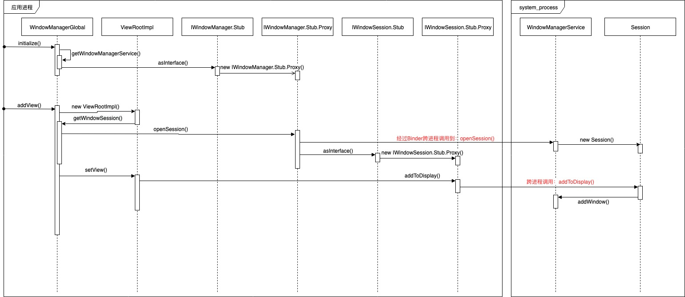

[TOC]

# ViewRootImpl.setView跨进程部分分析

## 前言

在 [寻找Activity布局树的根](寻找Activity布局树的根.md) 一文中，知道了`ViewRootImpl`作为布局树的根，但我们忽略了其中跨进程部分的代码分析，在经过 [Binder学习资料汇总](Binder学习资料汇总.md) 对`Binder(IPC)`有了一定的理解，接下来的分析部分需要相关知识的支撑。

## 开始分析

先查看`setView`的一段代码：

```java
...
res = mWindowSession.addToDisplay(mWindow, mSeq, mWindowAttributes,
        getHostVisibility(), mDisplay.getDisplayId(), mWinFrame,
        mAttachInfo.mContentInsets, mAttachInfo.mStableInsets,
        mAttachInfo.mOutsets, mAttachInfo.mDisplayCutout, mInputChannel);
...
```

### 初始IWindowManager和IWindowSession

查看`mWindowSession`的声明和初始化代码：

```java
final IWindowSession mWindowSession;
...
public ViewRootImpl(Context context, Display display) {
    mContext = context;
    mWindowSession = WindowManagerGlobal.getWindowSession();
    ...
}
```

跟进到`WindowManagerGlobal.getWindowSession()`函数：

```java
public static IWindowSession getWindowSession() {
    synchronized (WindowManagerGlobal.class) {
        if (sWindowSession == null) {
            try {
                InputMethodManager imm = InputMethodManager.getInstance();
                IWindowManager windowManager = getWindowManagerService();
                sWindowSession = windowManager.openSession(
                        new IWindowSessionCallback.Stub() {
                            @Override
                            public void onAnimatorScaleChanged(float scale) {
                                ValueAnimator.setDurationScale(scale);
                            }
                        },
                        imm.getClient(), imm.getInputContext());
            } catch (RemoteException e) {
                throw e.rethrowFromSystemServer();
            }
        }
        return sWindowSession;
    }
}

public static IWindowManager getWindowManagerService() {
    synchronized (WindowManagerGlobal.class) {
        if (sWindowManagerService == null) {
            sWindowManagerService = IWindowManager.Stub.asInterface(
                    ServiceManager.getService("window"));
            try {
                if (sWindowManagerService != null) {
                    ValueAnimator.setDurationScale(
                            sWindowManagerService.getCurrentAnimatorScale());
                }
            } catch (RemoteException e) {
                throw e.rethrowFromSystemServer();
            }
        }
        return sWindowManagerService;
    }
}
```

首先通过调用`getWindowManagerService()`获取`IWindowManager`，然后调用`windowManager.openSession()`获取`sWindowSession`，并且`sWindowSession`为静态变量，即表示该进程只有一个`IWindowSession`实例。

看下`IWindowManager`和`IWindowSession`的类定义：

```java
/**
 * System private interface to the window manager.
 * <p>
 * {@hide}
 */
public interface IWindowManager extends android.os.IInterface {
    /**
     * Local-side IPC implementation stub class.
     */
    public static abstract class Stub extends android.os.Binder implements android.view.IWindowManager {
        ...
        private static class Proxy implements android.view.IWindowManager {
            ...
        }
    }
}

/**
 * System private per-application interface to the window manager.
 * <p>
 * {@hide}
 */
public interface IWindowSession extends android.os.IInterface {
    /**
     * Local-side IPC implementation stub class.
     */
    public static abstract class Stub extends android.os.Binder implements android.view.IWindowSession {
        ...
        private static class Proxy implements android.view.IWindowSession {
            ...
        }
    }
}
```

`IWindowManager`和`IWindowSession`都是继承`IInterface`，有了对`Binder`机制的理解，很容易知道：

- `sWindowManagerService`为`IWindowManager`远程服务进程在当前进程的代理对象`IWindowManager.Stub.Proxy`
- `sWindowSession`为`IWindowSession`远程服务进程在当前进程的代理对象`IWindowManager.Stub.Proxy`

### 初始WindowManagerService和Session

查看`IWindowManager`的实现类，可以找到真正的实现类`WindowManagerService`，如果继续深入去看代码，根据构造函数的调用，可知该对象在`SystemServer`的`startOhterServices()`的调用中被创建，在往调用链查找，可知该服务运行在`system_process`系统进程，并且整个系统只有一个实例；

查看`IWindowSession`的实现类，也可以找到真正的实现类`Session`，根据构造函数的调用，可找到创建该对象的地方在`WindowManagerService.openSession()`函数中，同时一次调用就创建一个`Session`实例，结合`WindowManagerGlobal.getWindowSession()`函数中调用了`windowManager.openSession()`，该调用是跨进程的；

可进一步得出结论：

- `sWindowManagerService`为`WindowManagerService`远程服务进程在当前进程的代理对象，同时`WindowManagerService`实例在`system_process`系统进程中创建，整个系统中唯一
- `sWindowSession`为远程`Session`在当前进程的代理对象，同时每个进程拥有自己的远程`Session`实例，远程`Session`实例也是存在于系统进程`system_process`

现在知道了`IWindowSession`在远程服务的调用地方，就很容易找到`mWindowSession.addToDisplay()`的逻辑代码在`Session`类中：

```java
@Override
public int addToDisplay(IWindow window, int seq, WindowManager.LayoutParams attrs,
        int viewVisibility, int displayId, Rect outFrame, Rect outContentInsets,
        Rect outStableInsets, Rect outOutsets,
        DisplayCutout.ParcelableWrapper outDisplayCutout, InputChannel outInputChannel) {
    return mService.addWindow(this, window, seq, attrs, viewVisibility, displayId, outFrame,
            outContentInsets, outStableInsets, outOutsets, outDisplayCutout, outInputChannel);
}
```

`mService`为通过构造函数传入的`WindowManagerService`，所以进到`WindowManagerService.addWindow()`函数：

```java
public int addWindow(Session session, IWindow client, int seq,
        LayoutParams attrs, int viewVisibility, int displayId, Rect outFrame,
        Rect outContentInsets, Rect outStableInsets, Rect outOutsets,
        DisplayCutout.ParcelableWrapper outDisplayCutout, InputChannel outInputChannel) {
    int[] appOp = new int[1];
    // 检查权限
    int res = mPolicy.checkAddPermission(attrs, appOp);
    if (res != WindowManagerGlobal.ADD_OKAY) {
        return res;
    }

    boolean reportNewConfig = false;
    WindowState parentWindow = null;
    long origId;
    final int callingUid = Binder.getCallingUid();
    final int type = attrs.type;

    synchronized(mWindowMap) {
        if (!mDisplayReady) {
            throw new IllegalStateException("Display has not been initialialized");
        }

        final DisplayContent displayContent = getDisplayContentOrCreate(displayId);

        if (displayContent == null) {
            Slog.w(TAG_WM, "Attempted to add window to a display that does not exist: "
                    + displayId + ".  Aborting.");
            return WindowManagerGlobal.ADD_INVALID_DISPLAY;
        }
        if (!displayContent.hasAccess(session.mUid)
                && !mDisplayManagerInternal.isUidPresentOnDisplay(session.mUid, displayId)) {
            Slog.w(TAG_WM, "Attempted to add window to a display for which the application "
                    + "does not have access: " + displayId + ".  Aborting.");
            return WindowManagerGlobal.ADD_INVALID_DISPLAY;
        }

        if (mWindowMap.containsKey(client.asBinder())) {
            Slog.w(TAG_WM, "Window " + client + " is already added");
            return WindowManagerGlobal.ADD_DUPLICATE_ADD;
        }

        if (type >= FIRST_SUB_WINDOW && type <= LAST_SUB_WINDOW) {
            parentWindow = windowForClientLocked(null, attrs.token, false);
            if (parentWindow == null) {
                Slog.w(TAG_WM, "Attempted to add window with token that is not a window: "
                      + attrs.token + ".  Aborting.");
                return WindowManagerGlobal.ADD_BAD_SUBWINDOW_TOKEN;
            }
            if (parentWindow.mAttrs.type >= FIRST_SUB_WINDOW
                    && parentWindow.mAttrs.type <= LAST_SUB_WINDOW) {
                Slog.w(TAG_WM, "Attempted to add window with token that is a sub-window: "
                        + attrs.token + ".  Aborting.");
                return WindowManagerGlobal.ADD_BAD_SUBWINDOW_TOKEN;
            }
        }

        if (type == TYPE_PRIVATE_PRESENTATION && !displayContent.isPrivate()) {
            Slog.w(TAG_WM, "Attempted to add private presentation window to a non-private display.  Aborting.");
            return WindowManagerGlobal.ADD_PERMISSION_DENIED;
        }

        AppWindowToken atoken = null;
        final boolean hasParent = parentWindow != null;
        // Use existing parent window token for child windows since they go in the same token
        // as there parent window so we can apply the same policy on them.
        WindowToken token = displayContent.getWindowToken(
                hasParent ? parentWindow.mAttrs.token : attrs.token);
        // If this is a child window, we want to apply the same type checking rules as the
        // parent window type.
        final int rootType = hasParent ? parentWindow.mAttrs.type : type;

        boolean addToastWindowRequiresToken = false;

        if (token == null) {
            if (rootType >= FIRST_APPLICATION_WINDOW && rootType <= LAST_APPLICATION_WINDOW) {
                Slog.w(TAG_WM, "Attempted to add application window with unknown token "
                      + attrs.token + ".  Aborting.");
                return WindowManagerGlobal.ADD_BAD_APP_TOKEN;
            }
            if (rootType == TYPE_INPUT_METHOD) {
                Slog.w(TAG_WM, "Attempted to add input method window with unknown token "
                      + attrs.token + ".  Aborting.");
                return WindowManagerGlobal.ADD_BAD_APP_TOKEN;
            }
            if (rootType == TYPE_VOICE_INTERACTION) {
                Slog.w(TAG_WM, "Attempted to add voice interaction window with unknown token "
                      + attrs.token + ".  Aborting.");
                return WindowManagerGlobal.ADD_BAD_APP_TOKEN;
            }
            if (rootType == TYPE_WALLPAPER) {
                Slog.w(TAG_WM, "Attempted to add wallpaper window with unknown token "
                      + attrs.token + ".  Aborting.");
                return WindowManagerGlobal.ADD_BAD_APP_TOKEN;
            }
            if (rootType == TYPE_DREAM) {
                Slog.w(TAG_WM, "Attempted to add Dream window with unknown token "
                      + attrs.token + ".  Aborting.");
                return WindowManagerGlobal.ADD_BAD_APP_TOKEN;
            }
            if (rootType == TYPE_QS_DIALOG) {
                Slog.w(TAG_WM, "Attempted to add QS dialog window with unknown token "
                      + attrs.token + ".  Aborting.");
                return WindowManagerGlobal.ADD_BAD_APP_TOKEN;
            }
            if (rootType == TYPE_ACCESSIBILITY_OVERLAY) {
                Slog.w(TAG_WM, "Attempted to add Accessibility overlay window with unknown token "
                        + attrs.token + ".  Aborting.");
                return WindowManagerGlobal.ADD_BAD_APP_TOKEN;
            }
            if (type == TYPE_TOAST) {
                // Apps targeting SDK above N MR1 cannot arbitrary add toast windows.
                if (doesAddToastWindowRequireToken(attrs.packageName, callingUid,
                        parentWindow)) {
                    Slog.w(TAG_WM, "Attempted to add a toast window with unknown token "
                            + attrs.token + ".  Aborting.");
                    return WindowManagerGlobal.ADD_BAD_APP_TOKEN;
                }
            }
            final IBinder binder = attrs.token != null ? attrs.token : client.asBinder();
            final boolean isRoundedCornerOverlay =
                    (attrs.privateFlags & PRIVATE_FLAG_IS_ROUNDED_CORNERS_OVERLAY) != 0;
            token = new WindowToken(this, binder, type, false, displayContent,
                    session.mCanAddInternalSystemWindow, isRoundedCornerOverlay);
        } else if (rootType >= FIRST_APPLICATION_WINDOW && rootType <= LAST_APPLICATION_WINDOW) {
            atoken = token.asAppWindowToken();
            if (atoken == null) {
                Slog.w(TAG_WM, "Attempted to add window with non-application token "
                      + token + ".  Aborting.");
                return WindowManagerGlobal.ADD_NOT_APP_TOKEN;
            } else if (atoken.removed) {
                Slog.w(TAG_WM, "Attempted to add window with exiting application token "
                      + token + ".  Aborting.");
                return WindowManagerGlobal.ADD_APP_EXITING;
            } else if (type == TYPE_APPLICATION_STARTING && atoken.startingWindow != null) {
                Slog.w(TAG_WM, "Attempted to add starting window to token with already existing"
                        + " starting window");
                return WindowManagerGlobal.ADD_DUPLICATE_ADD;
            }
        } else if (rootType == TYPE_INPUT_METHOD) {
            if (token.windowType != TYPE_INPUT_METHOD) {
                Slog.w(TAG_WM, "Attempted to add input method window with bad token "
                        + attrs.token + ".  Aborting.");
                  return WindowManagerGlobal.ADD_BAD_APP_TOKEN;
            }
        } else if (rootType == TYPE_VOICE_INTERACTION) {
            if (token.windowType != TYPE_VOICE_INTERACTION) {
                Slog.w(TAG_WM, "Attempted to add voice interaction window with bad token "
                        + attrs.token + ".  Aborting.");
                  return WindowManagerGlobal.ADD_BAD_APP_TOKEN;
            }
        } else if (rootType == TYPE_WALLPAPER) {
            if (token.windowType != TYPE_WALLPAPER) {
                Slog.w(TAG_WM, "Attempted to add wallpaper window with bad token "
                        + attrs.token + ".  Aborting.");
                  return WindowManagerGlobal.ADD_BAD_APP_TOKEN;
            }
        } else if (rootType == TYPE_DREAM) {
            if (token.windowType != TYPE_DREAM) {
                Slog.w(TAG_WM, "Attempted to add Dream window with bad token "
                        + attrs.token + ".  Aborting.");
                  return WindowManagerGlobal.ADD_BAD_APP_TOKEN;
            }
        } else if (rootType == TYPE_ACCESSIBILITY_OVERLAY) {
            if (token.windowType != TYPE_ACCESSIBILITY_OVERLAY) {
                Slog.w(TAG_WM, "Attempted to add Accessibility overlay window with bad token "
                        + attrs.token + ".  Aborting.");
                return WindowManagerGlobal.ADD_BAD_APP_TOKEN;
            }
        } else if (type == TYPE_TOAST) {
            // Apps targeting SDK above N MR1 cannot arbitrary add toast windows.
            addToastWindowRequiresToken = doesAddToastWindowRequireToken(attrs.packageName,
                    callingUid, parentWindow);
            if (addToastWindowRequiresToken && token.windowType != TYPE_TOAST) {
                Slog.w(TAG_WM, "Attempted to add a toast window with bad token "
                        + attrs.token + ".  Aborting.");
                return WindowManagerGlobal.ADD_BAD_APP_TOKEN;
            }
        } else if (type == TYPE_QS_DIALOG) {
            if (token.windowType != TYPE_QS_DIALOG) {
                Slog.w(TAG_WM, "Attempted to add QS dialog window with bad token "
                        + attrs.token + ".  Aborting.");
                return WindowManagerGlobal.ADD_BAD_APP_TOKEN;
            }
        } else if (token.asAppWindowToken() != null) {
            Slog.w(TAG_WM, "Non-null appWindowToken for system window of rootType=" + rootType);
            // It is not valid to use an app token with other system types; we will
            // instead make a new token for it (as if null had been passed in for the token).
            attrs.token = null;
            token = new WindowToken(this, client.asBinder(), type, false, displayContent,
                    session.mCanAddInternalSystemWindow);
        }

        // 创建WindowState对象
        final WindowState win = new WindowState(this, session, client, token, parentWindow,
                appOp[0], seq, attrs, viewVisibility, session.mUid,
                session.mCanAddInternalSystemWindow);
        if (win.mDeathRecipient == null) {
            // Client has apparently died, so there is no reason to
            // continue.
            Slog.w(TAG_WM, "Adding window client " + client.asBinder()
                    + " that is dead, aborting.");
            return WindowManagerGlobal.ADD_APP_EXITING;
        }

        if (win.getDisplayContent() == null) {
            Slog.w(TAG_WM, "Adding window to Display that has been removed.");
            return WindowManagerGlobal.ADD_INVALID_DISPLAY;
        }

        final boolean hasStatusBarServicePermission =
                mContext.checkCallingOrSelfPermission(permission.STATUS_BAR_SERVICE)
                        == PackageManager.PERMISSION_GRANTED;
        mPolicy.adjustWindowParamsLw(win, win.mAttrs, hasStatusBarServicePermission);
        win.setShowToOwnerOnlyLocked(mPolicy.checkShowToOwnerOnly(attrs));

        res = mPolicy.prepareAddWindowLw(win, attrs);
        if (res != WindowManagerGlobal.ADD_OKAY) {
            return res;
        }

        final boolean openInputChannels = (outInputChannel != null
                && (attrs.inputFeatures & INPUT_FEATURE_NO_INPUT_CHANNEL) == 0);
        if  (openInputChannels) {
            win.openInputChannel(outInputChannel);
        }

        // If adding a toast requires a token for this app we always schedule hiding
        // toast windows to make sure they don't stick around longer then necessary.
        // We hide instead of remove such windows as apps aren't prepared to handle
        // windows being removed under them.
        //
        // If the app is older it can add toasts without a token and hence overlay
        // other apps. To be maximally compatible with these apps we will hide the
        // window after the toast timeout only if the focused window is from another
        // UID, otherwise we allow unlimited duration. When a UID looses focus we
        // schedule hiding all of its toast windows.
        if (type == TYPE_TOAST) {
            if (!getDefaultDisplayContentLocked().canAddToastWindowForUid(callingUid)) {
                Slog.w(TAG_WM, "Adding more than one toast window for UID at a time.");
                return WindowManagerGlobal.ADD_DUPLICATE_ADD;
            }
            // Make sure this happens before we moved focus as one can make the
            // toast focusable to force it not being hidden after the timeout.
            // Focusable toasts are always timed out to prevent a focused app to
            // show a focusable toasts while it has focus which will be kept on
            // the screen after the activity goes away.
            if (addToastWindowRequiresToken
                    || (attrs.flags & LayoutParams.FLAG_NOT_FOCUSABLE) == 0
                    || mCurrentFocus == null
                    || mCurrentFocus.mOwnerUid != callingUid) {
                mH.sendMessageDelayed(
                        mH.obtainMessage(H.WINDOW_HIDE_TIMEOUT, win),
                        win.mAttrs.hideTimeoutMilliseconds);
            }
        }

        // From now on, no exceptions or errors allowed!

        res = WindowManagerGlobal.ADD_OKAY;
        if (mCurrentFocus == null) {
            mWinAddedSinceNullFocus.add(win);
        }

        if (excludeWindowTypeFromTapOutTask(type)) {
            displayContent.mTapExcludedWindows.add(win);
        }

        origId = Binder.clearCallingIdentity();

        win.attach();
        // 保存到WindowHashMap，key为远程IWindow的本地代理对象BinderProxy，value为WindowState
        mWindowMap.put(client.asBinder(), win);

        ...
    }

    ...

    return res;
}
```

代码很多，但能看到主要的内容就是：

1. 进行权限检查（例如自定义的应用悬浮窗需要权限就是在此处检查）
2. 检查`token`是否合法，应用遇到`BadTokenException`各种错误原因都能在这找到
3. 把远程`IWindow`的本地代理对象`BinderProxy`和创建的窗体状态`WindowState`对象作为键值对保存起来

可以知道`IWindow`是通过`addWindow()`传参进来的，那`IWindow`是什么？

### 初始IWindow

看下`IWindow`定义：

```java
/**
 * API back to a client window that the Window Manager uses to inform it of
 * interesting things happening.
 * <p>
 * {@hide}
 */
public interface IWindow extends android.os.IInterface {
    /**
     * Local-side IPC implementation stub class.
     */
    public static abstract class Stub extends android.os.Binder implements android.view.IWindow {
        ...
        private static class Proxy implements android.view.IWindow {
            ...
        }
    }
    ...
}
```

同样是一个用于跨进程通讯的接口，类说明大致的意思是：”当有有趣的事情发生时，`window manager`用该接口来通知（回调）客户端窗体“。

回到`ViewRootImpl`类，找到`mWindow`声明、初始化的地方：

```java
...
final W mWindow;
...
public ViewRootImpl(Context context, Display display) {
        ...
        mWindow = new W(this);
    ...
}

static class W extends IWindow.Stub {
    private final WeakReference<ViewRootImpl> mViewAncestor;
    private final IWindowSession mWindowSession;

    W(ViewRootImpl viewAncestor) {
        mViewAncestor = new WeakReference<ViewRootImpl>(viewAncestor);
        mWindowSession = viewAncestor.mWindowSession;
    }
    ...
}
...
```

显然，静态内部类`W`是作为`IWindow`接口的真正实现，结合接口说明，可知道该类其实是作为回调存在的，只是特殊在它是跨进程的。

根据以上类关系，梳理出相关类图：


以及梳理出来函数调用的时序图（省略了`Binder`跨进程核心调用）：



## 小结

在 [寻找Activity布局树的根](寻找Activity布局树的根.md) 一文中，提到了`WindowManager`接口是用来与真正的`window manager`进行通讯，经过以上的分析可以知道，`WindowManagerService`就是真正的`window manager`，而且是存在于系统进程`system_process`中的。同时，每个进程在`system_process`进程都拥有对应的`Session`实例和存在于本地进程的代理对象`IWindowSession.Stub.Proxy`。当应用进程想要添加窗体时（例如`Activity`、`Dialog`，`PopupWindow`等等），会先创建视图树的根`ViewRootImpl`，经过`ViewRootImpl.setView()`函数调用，最终会跨进程调用到`Session.addToDisplay()`函数，该函数内部又调用`WindowManagerService.addWindow()`函数进行权限判断、`token`检查以及`IWindow`保存，最终才完成窗体的添加。