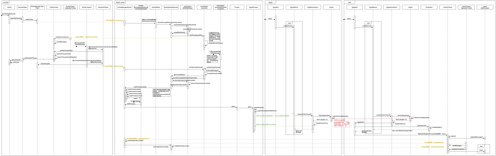

[TOC]

# 应用进程启动流程分析

## 前言

在[Android进程学习资料汇总](Android进程学习资料汇总.md)一文中，着重介绍了应用进程的创建过程，但未深入细节去分析，在[应用主线程ActivityThread](应用主线程ActivityThread.md)一文中，大致介绍了应用主线程如何进入`loop`状态，此篇将比较深入的去分析应用进程到底是如何创建并启动的，把两篇文章的知识串联起来。

## Launcher点击icon启动应用分析

参与该过程主要有4个进程：

1. `Launcher`进程：主要负责流程的发起

2. `system_server`进程：主要是`AMS`（即`ActivityManagerService`）服务负责调度
3. `zygote`进程：所有`java`进程的父进程，主要负责`fork`新的应用进程
4. 即将被创建的应用进程：启动后进行相关初始化，最终进入主线程`loop`状态

接下来边跟随完整时序图边展开具体分析（图片比较大，建议打开原图放大去看）。



### 阶段一：Launcher发起启动界面请求

`Launcher`作为特殊的应用程序，点击应用`icon`发起启动界面请求也是走`startActivity()`函数，经过内部调用，最终会走到`startActivityForResult()`：

#### Activity.startActivityForResult()

```java
public void startActivityForResult(@RequiresPermission Intent intent, int requestCode,
        @Nullable Bundle options) {
    if (mParent == null) {
        options = transferSpringboardActivityOptions(options);
        Instrumentation.ActivityResult ar =
            mInstrumentation.execStartActivity(
                this, mMainThread.getApplicationThread(), mToken, this,
                intent, requestCode, options);
        ...
    } else {
        ...
    }
}
```

#### Instrumentation.execStartActivity()

```java
public ActivityResult execStartActivity(
        Context who, IBinder contextThread, IBinder token, Activity target,
        Intent intent, int requestCode, Bundle options) {
    IApplicationThread whoThread = (IApplicationThread) contextThread;
    Uri referrer = target != null ? target.onProvideReferrer() : null;
    if (referrer != null) {
        intent.putExtra(Intent.EXTRA_REFERRER, referrer);
    }
    ...
    try {
        intent.migrateExtraStreamToClipData();
        intent.prepareToLeaveProcess(who);
        // 通过Binder跨进程调用system_server进程中AMS的startActivity方法
        int result = ActivityManager.getService()
            .startActivity(whoThread, who.getBasePackageName(), intent,
                    intent.resolveTypeIfNeeded(who.getContentResolver()),
                    token, target != null ? target.mEmbeddedID : null,
                    requestCode, 0, null, options);
        checkStartActivityResult(result, intent);
    } catch (RemoteException e) {
        throw new RuntimeException("Failure from system", e);
    }
    return null;
}
```

### 阶段二：AMS在Binder线程处理启动页面请求

```java
@Override
public final int startActivity(IApplicationThread caller, String callingPackage,
        Intent intent, String resolvedType, IBinder resultTo, String resultWho, int requestCode,
        int startFlags, ProfilerInfo profilerInfo, Bundle bOptions) {
    return startActivityAsUser(caller, callingPackage, intent, resolvedType, resultTo,
            resultWho, requestCode, startFlags, profilerInfo, bOptions,
            UserHandle.getCallingUserId());
}
```

注意没有线程转发相关逻辑，所以`startActivity()`执行在`Binder`线程，经过多个内部函数调用，最终执行到`startActivityAsUser()`：

#### ActivityManagerService.startActivityAsUser()

```java
public final int startActivityAsUser(IApplicationThread caller, String callingPackage,
        Intent intent, String resolvedType, IBinder resultTo, String resultWho, int requestCode,
        int startFlags, ProfilerInfo profilerInfo, Bundle bOptions, int userId,
        boolean validateIncomingUser) {
    enforceNotIsolatedCaller("startActivity");

    userId = mActivityStartController.checkTargetUser(userId, validateIncomingUser,
            Binder.getCallingPid(), Binder.getCallingUid(), "startActivityAsUser");

    // TODO: Switch to user app stacks here.
    return mActivityStartController.obtainStarter(intent, "startActivityAsUser")
            .setCaller(caller)
            .setCallingPackage(callingPackage)
            .setResolvedType(resolvedType)
            .setResultTo(resultTo)
            .setResultWho(resultWho)
            .setRequestCode(requestCode)
            .setStartFlags(startFlags)
            .setProfilerInfo(profilerInfo)
            .setActivityOptions(bOptions)
            .setMayWait(userId) // 内部设置mayWait=true
            .execute();

}
```

`mActivityStartController`为`ActivityStartController`的实例，在`AMS`实例化的时候进行创建，主要负责代理启动`activity`的过程。

通过`obtainStarter()`以及一串链式调用构造`ActivityStarter`，并最终执行`execute()`。

#### ActivityStarter.execute()

```java
int execute() {
    try {
        // TODO(b/64750076): Look into passing request directly to these methods to allow
        // for transactional diffs and preprocessing.
        if (mRequest.mayWait) { // 该标记为true，进入条件
            return startActivityMayWait(mRequest.caller, mRequest.callingUid,
                    mRequest.callingPackage, mRequest.intent, mRequest.resolvedType,
                    mRequest.voiceSession, mRequest.voiceInteractor, mRequest.resultTo,
                    mRequest.resultWho, mRequest.requestCode, mRequest.startFlags,
                    mRequest.profilerInfo, mRequest.waitResult, mRequest.globalConfig,
                    mRequest.activityOptions, mRequest.ignoreTargetSecurity, mRequest.userId,
                    mRequest.inTask, mRequest.reason,
                    mRequest.allowPendingRemoteAnimationRegistryLookup,
                    mRequest.originatingPendingIntent);
        } else {
            return startActivity(mRequest.caller, mRequest.intent, mRequest.ephemeralIntent,
                    mRequest.resolvedType, mRequest.activityInfo, mRequest.resolveInfo,
                    mRequest.voiceSession, mRequest.voiceInteractor, mRequest.resultTo,
                    mRequest.resultWho, mRequest.requestCode, mRequest.callingPid,
                    mRequest.callingUid, mRequest.callingPackage, mRequest.realCallingPid,
                    mRequest.realCallingUid, mRequest.startFlags, mRequest.activityOptions,
                    mRequest.ignoreTargetSecurity, mRequest.componentSpecified,
                    mRequest.outActivity, mRequest.inTask, mRequest.reason,
                    mRequest.allowPendingRemoteAnimationRegistryLookup,
                    mRequest.originatingPendingIntent);
        }
    } finally {
        onExecutionComplete();
    }
}
```

#### ActivityStarter.startActivityMayWait()

```java
private int startActivityMayWait(IApplicationThread caller, int callingUid,
        String callingPackage, Intent intent, String resolvedType,
        IVoiceInteractionSession voiceSession, IVoiceInteractor voiceInteractor,
        IBinder resultTo, String resultWho, int requestCode, int startFlags,
        ProfilerInfo profilerInfo, WaitResult outResult,
        Configuration globalConfig, SafeActivityOptions options, boolean ignoreTargetSecurity,
        int userId, TaskRecord inTask, String reason,
        boolean allowPendingRemoteAnimationRegistryLookup,
        PendingIntentRecord originatingPendingIntent) {
    
    ...
    // Collect information about the target of the Intent.
    ActivityInfo aInfo = mSupervisor.resolveActivity(intent, rInfo, startFlags, profilerInfo);

    synchronized (mService) {
        ...
        final ActivityRecord[] outRecord = new ActivityRecord[1];
        int res = startActivity(caller, intent, ephemeralIntent, resolvedType, aInfo, rInfo,
                voiceSession, voiceInteractor, resultTo, resultWho, requestCode, callingPid,
                callingUid, callingPackage, realCallingPid, realCallingUid, startFlags, options,
                ignoreTargetSecurity, componentSpecified, outRecord, inTask, reason,
                allowPendingRemoteAnimationRegistryLookup, originatingPendingIntent);
        ...
        return res;
    }
}
```

#### Activity.startActivity()

```java
private int startActivity(IApplicationThread caller, Intent intent, Intent ephemeralIntent,
        String resolvedType, ActivityInfo aInfo, ResolveInfo rInfo,
        IVoiceInteractionSession voiceSession, IVoiceInteractor voiceInteractor,
        IBinder resultTo, String resultWho, int requestCode, int callingPid, int callingUid,
        String callingPackage, int realCallingPid, int realCallingUid, int startFlags,
        SafeActivityOptions options, boolean ignoreTargetSecurity, boolean componentSpecified,
        ActivityRecord[] outActivity, TaskRecord inTask, String reason,
        boolean allowPendingRemoteAnimationRegistryLookup,
        PendingIntentRecord originatingPendingIntent) {

    if (TextUtils.isEmpty(reason)) {
        throw new IllegalArgumentException("Need to specify a reason.");
    }
    mLastStartReason = reason;
    mLastStartActivityTimeMs = System.currentTimeMillis();
    mLastStartActivityRecord[0] = null;

    mLastStartActivityResult = startActivity(caller, intent, ephemeralIntent, resolvedType,
            aInfo, rInfo, voiceSession, voiceInteractor, resultTo, resultWho, requestCode,
            callingPid, callingUid, callingPackage, realCallingPid, realCallingUid, startFlags,
            options, ignoreTargetSecurity, componentSpecified, mLastStartActivityRecord,
            inTask, allowPendingRemoteAnimationRegistryLookup, originatingPendingIntent);

    if (outActivity != null) {
        // mLastStartActivityRecord[0] is set in the call to startActivity above.
        outActivity[0] = mLastStartActivityRecord[0];
    }

    return getExternalResult(mLastStartActivityResult);
}
```

继续调用重载函数：

```java
private int startActivity(IApplicationThread caller, Intent intent, Intent ephemeralIntent,
        String resolvedType, ActivityInfo aInfo, ResolveInfo rInfo,
        IVoiceInteractionSession voiceSession, IVoiceInteractor voiceInteractor,
        IBinder resultTo, String resultWho, int requestCode, int callingPid, int callingUid,
        String callingPackage, int realCallingPid, int realCallingUid, int startFlags,
        SafeActivityOptions options,
        boolean ignoreTargetSecurity, boolean componentSpecified, ActivityRecord[] outActivity,
        TaskRecord inTask, boolean allowPendingRemoteAnimationRegistryLookup,
        PendingIntentRecord originatingPendingIntent) {
    int err = ActivityManager.START_SUCCESS;
    ...

    ActivityRecord r = new ActivityRecord(mService, callerApp, callingPid, callingUid,
            callingPackage, intent, resolvedType, aInfo, mService.getGlobalConfiguration(),
            resultRecord, resultWho, requestCode, componentSpecified, voiceSession != null,
            mSupervisor, checkedOptions, sourceRecord);
    if (outActivity != null) {
        outActivity[0] = r;
    }

    ...

    return startActivity(r, sourceRecord, voiceSession, voiceInteractor, startFlags,
            true /* doResume */, checkedOptions, inTask, outActivity);
}
```

再次调用重载函数：

```java
private int startActivity(final ActivityRecord r, ActivityRecord sourceRecord,
            IVoiceInteractionSession voiceSession, IVoiceInteractor voiceInteractor,
            int startFlags, boolean doResume, ActivityOptions options, TaskRecord inTask,
            ActivityRecord[] outActivity) {
    int result = START_CANCELED;
    try {
        mService.mWindowManager.deferSurfaceLayout();
        result = startActivityUnchecked(r, sourceRecord, voiceSession, voiceInteractor,
                startFlags, doResume, options, inTask, outActivity);
    } finally {
        // If we are not able to proceed, disassociate the activity from the task. Leaving an
        // activity in an incomplete state can lead to issues, such as performing operations
        // without a window container.
        final ActivityStack stack = mStartActivity.getStack();
        if (!ActivityManager.isStartResultSuccessful(result) && stack != null) {
            stack.finishActivityLocked(mStartActivity, RESULT_CANCELED,
                    null /* intentResultData */, "startActivity", true /* oomAdj */);
        }
        mService.mWindowManager.continueSurfaceLayout();
    }

    postStartActivityProcessing(r, result, mTargetStack);

    return result;
}
```

#### Activity.startActivityUnchecked()

```java
private int startActivityUnchecked(final ActivityRecord r, ActivityRecord sourceRecord,
        IVoiceInteractionSession voiceSession, IVoiceInteractor voiceInteractor,
        int startFlags, boolean doResume, ActivityOptions options, TaskRecord inTask,
        ActivityRecord[] outActivity) {

    ...
    // Should this be considered a new task?
    int result = START_SUCCESS;
    if (mStartActivity.resultTo == null && mInTask == null && !mAddingToTask
            && (mLaunchFlags & FLAG_ACTIVITY_NEW_TASK) != 0) {
        // 应用界面对应的task不存在，创建mTargetStack
        newTask = true;
        result = setTaskFromReuseOrCreateNewTask(taskToAffiliate, topStack);
    } else if (mSourceRecord != null) {
        result = setTaskFromSourceRecord();
    } else if (mInTask != null) {
        result = setTaskFromInTask();
    } else {
        // This not being started from an existing activity, and not part of a new task...
        // just put it in the top task, though these days this case should never happen.
        setTaskToCurrentTopOrCreateNewTask();
    }
    ...
    if (mDoResume) {
        final ActivityRecord topTaskActivity =
                mStartActivity.getTask().topRunningActivityLocked();
        // mTargetStack为新创建的，条件不满足
        if (!mTargetStack.isFocusable()
                || (topTaskActivity != null && topTaskActivity.mTaskOverlay
                && mStartActivity != topTaskActivity)) {
            // If the activity is not focusable, we can't resume it, but still would like to
            // make sure it becomes visible as it starts (this will also trigger entry
            // animation). An example of this are PIP activities.
            // Also, we don't want to resume activities in a task that currently has an overlay
            // as the starting activity just needs to be in the visible paused state until the
            // over is removed.
            mTargetStack.ensureActivitiesVisibleLocked(null, 0, !PRESERVE_WINDOWS);
            // Go ahead and tell window manager to execute app transition for this activity
            // since the app transition will not be triggered through the resume channel.
            mService.mWindowManager.executeAppTransition();
        } else {
            // If the target stack was not previously focusable (previous top running activity
            // on that stack was not visible) then any prior calls to move the stack to the
            // will not update the focused stack.  If starting the new activity now allows the
            // task stack to be focusable, then ensure that we now update the focused stack
            // accordingly.
            if (mTargetStack.isFocusable() && !mSupervisor.isFocusedStack(mTargetStack)) {
                mTargetStack.moveToFront("startActivityUnchecked");
            }
            // 执行该路径
            mSupervisor.resumeFocusedStackTopActivityLocked(mTargetStack, mStartActivity,
                    mOptions);
        }
    } else if (mStartActivity != null) {
        mSupervisor.mRecentTasks.add(mStartActivity.getTask());
    }
    mSupervisor.updateUserStackLocked(mStartActivity.userId, mTargetStack);

    mSupervisor.handleNonResizableTaskIfNeeded(mStartActivity.getTask(), preferredWindowingMode,
            preferredLaunchDisplayId, mTargetStack);

    return START_SUCCESS;
}
```

#### ActivityStackSupervisor.resumeFocusedStackTopActivityLocked()

```java
boolean resumeFocusedStackTopActivityLocked(
        ActivityStack targetStack, ActivityRecord target, ActivityOptions targetOptions) {

    if (!readyToResume()) {
        return false;
    }

    if (targetStack != null && isFocusedStack(targetStack)) {
        return targetStack.resumeTopActivityUncheckedLocked(target, targetOptions);
    }

    ...

    return false;
}
```

`targetStack`表示即将启动的页面所在的`ActivityStack`

#### ActivityStack.resumeTopActivityUncheckedLocked()

```java
boolean resumeTopActivityUncheckedLocked(ActivityRecord prev, ActivityOptions options) {
    if (mStackSupervisor.inResumeTopActivity) {
        // Don't even start recursing.
        return false;
    }

    boolean result = false;
    try {
        // Protect against recursion.
        mStackSupervisor.inResumeTopActivity = true;
        result = resumeTopActivityInnerLocked(prev, options);

        // When resuming the top activity, it may be necessary to pause the top activity (for
        // example, returning to the lock screen. We suppress the normal pause logic in
        // {@link #resumeTopActivityUncheckedLocked}, since the top activity is resumed at the
        // end. We call the {@link ActivityStackSupervisor#checkReadyForSleepLocked} again here
        // to ensure any necessary pause logic occurs. In the case where the Activity will be
        // shown regardless of the lock screen, the call to
        // {@link ActivityStackSupervisor#checkReadyForSleepLocked} is skipped.
        final ActivityRecord next = topRunningActivityLocked(true /* focusableOnly */);
        if (next == null || !next.canTurnScreenOn()) {
            checkReadyForSleep();
        }
    } finally {
        mStackSupervisor.inResumeTopActivity = false;
    }

    return result;
}
```

#### ActivityStack.resumeTopActivityInnerLocked()

```java
private boolean resumeTopActivityInnerLocked(ActivityRecord prev, ActivityOptions options) {
    ...
    // 判断是否有stack需要pause，因为当前launcher所在stack为focusedStack，所以该方法会返回true
    boolean pausing = mStackSupervisor.pauseBackStacks(userLeaving, next, false);
    if (mResumedActivity != null) {
        if (DEBUG_STATES) Slog.d(TAG_STATES,
                "resumeTopActivityLocked: Pausing " + mResumedActivity);
        pausing |= startPausingLocked(userLeaving, false, next, false);
    }
    if (pausing && !resumeWhilePausing) { // 该添加将满足
        if (DEBUG_SWITCH || DEBUG_STATES) Slog.v(TAG_STATES,
                "resumeTopActivityLocked: Skip resume: need to start pausing");
        // At this point we want to put the upcoming activity's process
        // at the top of the LRU list, since we know we will be needing it
        // very soon and it would be a waste to let it get killed if it
        // happens to be sitting towards the end.
        if (next.app != null && next.app.thread != null) {
            mService.updateLruProcessLocked(next.app, true, null);
        }
        if (DEBUG_STACK) mStackSupervisor.validateTopActivitiesLocked();
        if (lastResumed != null) {
            lastResumed.setWillCloseOrEnterPip(true);
        }
        // 中断方法执行
        return true;
    } else if (mResumedActivity == next && next.isState(RESUMED)
            && mStackSupervisor.allResumedActivitiesComplete()) {
        ...
        return true;
    }
    ...
    return true;
}
```

#### ActivityStackSupervisor.pauseBackStacks()

```java
boolean pauseBackStacks(boolean userLeaving, ActivityRecord resuming, boolean dontWait) {
    boolean someActivityPaused = false;
    for (int displayNdx = mActivityDisplays.size() - 1; displayNdx >= 0; --displayNdx) {
        final ActivityDisplay display = mActivityDisplays.valueAt(displayNdx);
        for (int stackNdx = display.getChildCount() - 1; stackNdx >= 0; --stackNdx) {
            final ActivityStack stack = display.getChildAt(stackNdx);
            if (!isFocusedStack(stack) && stack.getResumedActivity() != null) {
                if (DEBUG_STATES) Slog.d(TAG_STATES, "pauseBackStacks: stack=" + stack +
                        " mResumedActivity=" + stack.getResumedActivity());
                // launcher所在的stack将执行该函数，并返回true
                someActivityPaused |= stack.startPausingLocked(userLeaving, false, resuming,
                        dontWait);
            }
        }
    }
    return someActivityPaused;
}
```

### 阶段三：当前显示的Launcher所在的ActivityStack执行pause操作

#### ActivityStack.startPausingLocked()

```java
final boolean startPausingLocked(boolean userLeaving, boolean uiSleeping,
        ActivityRecord resuming, boolean pauseImmediately) {
    ...
    ActivityRecord prev = mResumedActivity;
    ...
    // 把当前显示的activity赋值给mPausingActivity
    mPausingActivity = prev;
    mLastPausedActivity = prev;
    ...

    if (prev.app != null && prev.app.thread != null) {
        ...
        try {
            ...
            mService.updateUsageStats(prev, false);
            // 重点！！！
            // Binder跨进程调用通知Launcher进程pause掉当前显示的activity
            mService.getLifecycleManager().scheduleTransaction(prev.app.thread, prev.appToken,
                    PauseActivityItem.obtain(prev.finishing, userLeaving,
                            prev.configChangeFlags, pauseImmediately));
        } catch (Exception e) {
            ...
        }
    } else {
        ...
    }

    ...

    if (mPausingActivity != null) {
        ...
        if (pauseImmediately) { // 查看调用的参数可知值为false
            // If the caller said they don't want to wait for the pause, then complete
            // the pause now.
            completePauseLocked(false, resuming);
            return false;

        } else {
            // 为了防止Launcher进程执行pause时间过久无响应，方法内部会发送一条500ms超时消息
            // 最终调用与正常执行pause会调用到一致的函数入口activityPausedLocked()
            schedulePauseTimeout(prev);
            return true;
        }

    } else {
        // This activity failed to schedule the
        // pause, so just treat it as being paused now.
        if (DEBUG_PAUSE) Slog.v(TAG_PAUSE, "Activity not running, resuming next.");
        if (resuming == null) {
            mStackSupervisor.resumeFocusedStackTopActivityLocked();
        }
        return false;
    }
}
```

关于`schedulePauseTimeout()`就不深入分析，因为最终会和正常执行`pause`一样都进入到函数`activityPausedLocked()`，主要分析正常执行路径。

#### ClientLifecycleManager.scheduleTransaction()

```java
void scheduleTransaction(@NonNull IApplicationThread client, @NonNull IBinder activityToken,
        @NonNull ActivityLifecycleItem stateRequest) throws RemoteException {
    // 创建PauseActivityItem对应的ClientTransaction
    final ClientTransaction clientTransaction = transactionWithState(client, activityToken,
            stateRequest);
    scheduleTransaction(clientTransaction);
}

void scheduleTransaction(ClientTransaction transaction) throws RemoteException {
    final IApplicationThread client = transaction.getClient();
    transaction.schedule();
    if (!(client instanceof Binder)) {
        // If client is not an instance of Binder - it's a remote call and at this point it is
        // safe to recycle the object. All objects used for local calls will be recycled after
        // the transaction is executed on client in ActivityThread.
        transaction.recycle();
    }
}
```

#### ClientTransaction.schedule()

```java
public void schedule() throws RemoteException {
    // 跨进程调用
    mClient.scheduleTransaction(this);
}
```

`mClient`为`IApplicationThread`，是`Launcher`进程在`system_server`的远程代理对象，调用该代理对象的方法即通过`Binder`跨进程调用到`Launcher`进程对应的方法。

### 阶段四：Launcher进程当前显示的页面执行pause

#### ActivityThread.ApplicationThread.scheduleTransaction()

```java
@Override
public void scheduleTransaction(ClientTransaction transaction) throws RemoteException {
    ActivityThread.this.scheduleTransaction(transaction);
}
```

调用`ActivityThread`父类`ClientTransactionHandler`对应的方法，因为是`Binder`跨进程调用，所以执行在`Binder`线程上。

#### ClientTransactionHandler.scheduleTransaction()

```java
/** Prepare and schedule transaction for execution. */
void scheduleTransaction(ClientTransaction transaction) {
    transaction.preExecute(this);
    sendMessage(ActivityThread.H.EXECUTE_TRANSACTION, transaction);
}
```

#### ActivityThread.sendMessage()

```java
private void sendMessage(int what, Object obj, int arg1, int arg2, boolean async) {
    if (DEBUG_MESSAGES) Slog.v(
        TAG, "SCHEDULE " + what + " " + mH.codeToString(what)
        + ": " + arg1 + " / " + obj);
    Message msg = Message.obtain();
    msg.what = what;
    msg.obj = obj;
    msg.arg1 = arg1;
    msg.arg2 = arg2;
    if (async) {
        msg.setAsynchronous(true);
    }
    mH.sendMessage(msg);
}
```

`mH`是`ActivityThread`内部类`H`，该`Handler`持有的`Looper`为应用主线程所在`Looper`，所以`sendMessage`将`pause`操作的执行转发到主线程上。

需要注意的是，函数执行后，函数执行逻辑将回到`AMS`的`Binder`跨进程调用入口处继续往下执行，而`Launcher`进程将正常处理主线程上未处理的消息。

> 这里也体现了`Binder`跨进程的设计，对于使用者的感受就跟本地调用一样，方法是按顺序执行的，但实质上Binder跨进程调用的执行都是在`Binder`线程上。

#### ActivityThread.H.handleMessage()

```java
public void handleMessage(Message msg) {
    if (DEBUG_MESSAGES) Slog.v(TAG, ">>> handling: " + codeToString(msg.what));
    switch (msg.what) {
        ...
        case EXECUTE_TRANSACTION:
            final ClientTransaction transaction = (ClientTransaction) msg.obj;
            // 执行
            mTransactionExecutor.execute(transaction);
            if (isSystem()) {
                // Client transactions inside system process are recycled on the client side
                // instead of ClientLifecycleManager to avoid being cleared before this
                // message is handled.
                transaction.recycle();
            }
            // TODO(lifecycler): Recycle locally scheduled transactions.
            break;
        ...
    }
    Object obj = msg.obj;
    if (obj instanceof SomeArgs) {
        ((SomeArgs) obj).recycle();
    }
    if (DEBUG_MESSAGES) Slog.v(TAG, "<<< done: " + codeToString(msg.what));
}
```

#### TransactionExecutor.execute()

```java
/**
 * Resolve transaction.
 * First all callbacks will be executed in the order they appear in the list. If a callback
 * requires a certain pre- or post-execution state, the client will be transitioned accordingly.
 * Then the client will cycle to the final lifecycle state if provided. Otherwise, it will
 * either remain in the initial state, or last state needed by a callback.
 */
public void execute(ClientTransaction transaction) {
    final IBinder token = transaction.getActivityToken();
    log("Start resolving transaction for client: " + mTransactionHandler + ", token: " + token);

    executeCallbacks(transaction);
    // 注意ClientLifecycleManager在构造ClientTransaction执行的方法
    executeLifecycleState(transaction);
    mPendingActions.clear();
    log("End resolving transaction");
}
```

#### TransactionExecutor.executeLifecycleState()

```java
private void executeLifecycleState(ClientTransaction transaction) {
    // lifecycleItem为PauseActivityItem
    final ActivityLifecycleItem lifecycleItem = transaction.getLifecycleStateRequest();
    ...
    // Execute the final transition with proper parameters.
    // 先执行execute
    lifecycleItem.execute(mTransactionHandler, token, mPendingActions);
    // 再执行postExecute
    lifecycleItem.postExecute(mTransactionHandler, token, mPendingActions);
}
```

####PauseActivityItem.execute()

```java
public void execute(ClientTransactionHandler client, IBinder token,
        PendingTransactionActions pendingActions) {
    Trace.traceBegin(TRACE_TAG_ACTIVITY_MANAGER, "activityPause");
    // client为ActivityThread
    client.handlePauseActivity(token, mFinished, mUserLeaving, mConfigChanges, pendingActions,
            "PAUSE_ACTIVITY_ITEM");
    Trace.traceEnd(TRACE_TAG_ACTIVITY_MANAGER);
}
```

#### ActivityThread.handlePauseActivity()

```java
public void handlePauseActivity(IBinder token, boolean finished, boolean userLeaving,
        int configChanges, PendingTransactionActions pendingActions, String reason) {
    ActivityClientRecord r = mActivities.get(token);
    if (r != null) {
        if (userLeaving) {
            performUserLeavingActivity(r);
        }

        r.activity.mConfigChangeFlags |= configChanges;
        performPauseActivity(r, finished, reason, pendingActions);
        ...
    }
}
```

#### ActivityThread.performPauseActivity()

```java
private Bundle performPauseActivity(ActivityClientRecord r, boolean finished, String reason,
        PendingTransactionActions pendingActions) {
    ...
    if (finished) {
        r.activity.mFinished = true;
    }

    // Pre-Honeycomb apps always save their state before pausing
    final boolean shouldSaveState = !r.activity.mFinished && r.isPreHoneycomb();
    if (shouldSaveState) {
        callActivityOnSaveInstanceState(r);
    }

    // 如果需要触发执行onPause
    performPauseActivityIfNeeded(r, reason);

    // Notify any outstanding on paused listeners
    ArrayList<OnActivityPausedListener> listeners;
    synchronized (mOnPauseListeners) {
        listeners = mOnPauseListeners.remove(r.activity);
    }
    int size = (listeners != null ? listeners.size() : 0);
    for (int i = 0; i < size; i++) {
        listeners.get(i).onPaused(r.activity);
    }

    final Bundle oldState = pendingActions != null ? pendingActions.getOldState() : null;
    if (oldState != null) {
        // We need to keep around the original state, in case we need to be created again.
        // But we only do this for pre-Honeycomb apps, which always save their state when
        // pausing, so we can not have them save their state when restarting from a paused
        // state. For HC and later, we want to (and can) let the state be saved as the
        // normal part of stopping the activity.
        if (r.isPreHoneycomb()) {
            r.state = oldState;
        }
    }

    return shouldSaveState ? r.state : null;
}
```

#### ActivityThread.performPauseActivityIfNeeded()

```java
private void performPauseActivityIfNeeded(ActivityClientRecord r, String reason) {
    if (r.paused) {
        // You are already paused silly...
        return;
    }

    try {
        r.activity.mCalled = false;
        // 回调activity的onPause()函数
        mInstrumentation.callActivityOnPause(r.activity);
        if (!r.activity.mCalled) {
            throw new SuperNotCalledException("Activity " + safeToComponentShortString(r.intent)
                    + " did not call through to super.onPause()");
        }
    } catch (SuperNotCalledException e) {
        throw e;
    } catch (Exception e) {
        if (!mInstrumentation.onException(r.activity, e)) {
            throw new RuntimeException("Unable to pause activity "
                    + safeToComponentShortString(r.intent) + ": " + e.toString(), e);
        }
    }
    r.setState(ON_PAUSE);
}
```

#### Instrumentation.callActivityOnPause()

```java
public void callActivityOnPause(Activity activity) {
    activity.performPause();
}
```

#### Activity.performPause()

```java
final void performPause() {
    mDoReportFullyDrawn = false;
    mFragments.dispatchPause();
    mCalled = false;
    // 执行onPause()
    onPause();
    writeEventLog(LOG_AM_ON_PAUSE_CALLED, "performPause");
    mResumed = false;
    if (!mCalled && getApplicationInfo().targetSdkVersion
            >= android.os.Build.VERSION_CODES.GINGERBREAD) {
        throw new SuperNotCalledException(
                "Activity " + mComponent.toShortString() +
                " did not call through to super.onPause()");
    }
}
```

到此，`Launcher`的显示界面将会执行声明周期函数`onPause()`。

继续回到最初的调用入口函数`TransactionExecutor.executeLifecycleState()`，看`PauseActivityItem.postExecute()`调用。

#### PauseActivityItem.postExecute()

```java
public void postExecute(ClientTransactionHandler client, IBinder token,
        PendingTransactionActions pendingActions) {
    if (mDontReport) {
        return;
    }
    try {
        // binder跨进程
        // TODO(lifecycler): Use interface callback instead of AMS.
        ActivityManager.getService().activityPaused(token);
    } catch (RemoteException ex) {
        throw ex.rethrowFromSystemServer();
    }
}
```

### 阶段五：回调AMS显示目标应用ActivityStack

#### ActivityManagerService.activityPaused()

```java
public final void activityPaused(IBinder token) {
    final long origId = Binder.clearCallingIdentity();
    // 加锁，注意AMS会涉及多线程调用
    synchronized(this) {
        // 注意该stack为launcher所在stack
        ActivityStack stack = ActivityRecord.getStackLocked(token);
        if (stack != null) {
            stack.activityPausedLocked(token, false);
        }
    }
    Binder.restoreCallingIdentity(origId);
}
```

该函数也是在`Binder`线程调用的。

#### ActivityStack.activityPausedLocked()

```java
final void activityPausedLocked(IBinder token, boolean timeout) {
    ...
    final ActivityRecord r = isInStackLocked(token);
    if (r != null) {
        // 移除掉在startPausingLocked()时发的超时消息
        mHandler.removeMessages(PAUSE_TIMEOUT_MSG, r);
        if (mPausingActivity == r) {
            if (DEBUG_STATES) Slog.v(TAG_STATES, "Moving to PAUSED: " + r
                    + (timeout ? " (due to timeout)" : " (pause complete)"));
            mService.mWindowManager.deferSurfaceLayout();
            try {
                completePauseLocked(true /* resumeNext */, null /* resumingActivity */);
            } finally {
                mService.mWindowManager.continueSurfaceLayout();
            }
            return;
        } else {
            ...
        }
    }
    ...
}
```

#### ActivityStack.completePauseLocked()

```java
private void completePauseLocked(boolean resumeNext, ActivityRecord resuming) {
    ActivityRecord prev = mPausingActivity;
    ...
    // 参数resumeNext为true
    if (resumeNext) {
        // 获取topStack，即为即将显示的应用stack
        final ActivityStack topStack = mStackSupervisor.getFocusedStack();
        if (!topStack.shouldSleepOrShutDownActivities()) {
            mStackSupervisor.resumeFocusedStackTopActivityLocked(topStack, prev, null);
        } else {
            ...
        }
    }

    ...

    mStackSupervisor.ensureActivitiesVisibleLocked(resuming, 0, !PRESERVE_WINDOWS);
}
```

仍然执行`ActivityStackSupervisor.resumeFocusedStackTopActivityLocked()`，最终会调用到`ActivityStack.resumeTopActivityInnerLocked()`

#### ActivityStack.resumeTopActivityInnerLocked()

```java
private boolean resumeTopActivityInnerLocked(ActivityRecord prev, ActivityOptions options) {
    ...
    // next为即将启动的activity对应的ActivityRecord
    // Find the next top-most activity to resume in this stack that is not finishing and is
    // focusable. If it is not focusable, we will fall into the case below to resume the
    // top activity in the next focusable task.
    final ActivityRecord next = topRunningActivityLocked(true /* focusableOnly */);
    ...
    // 当前没有需要pause的stacks，返回false
    boolean pausing = mStackSupervisor.pauseBackStacks(userLeaving, next, false);
    // mResumedActivity此时为null
    if (mResumedActivity != null) {
        if (DEBUG_STATES) Slog.d(TAG_STATES,
                "resumeTopActivityLocked: Pausing " + mResumedActivity);
        pausing |= startPausingLocked(userLeaving, false, next, false);
    }
    if (pausing && !resumeWhilePausing) {
        ...
        return true;
    } else if (mResumedActivity == next && next.isState(RESUMED)
            && mStackSupervisor.allResumedActivitiesComplete()) {
        ...
        return true;
    }
    ...
    // 即将启动的页面进程还未创建，此时next.app=null
    if (next.app != null && next.app.thread != null) {
        ...
    } else {
        // Whoops, need to restart this activity!
        ...
        // 执行启动页面
        mStackSupervisor.startSpecificActivityLocked(next, true, true);
    }

    ...
    return true;
}
```

#### ActivityStackSupervisor.startSpecificActivityLocked()

```java
void startSpecificActivityLocked(ActivityRecord r,
        boolean andResume, boolean checkConfig) {
    // Is this activity's application already running?
    ProcessRecord app = mService.getProcessRecordLocked(r.processName,
            r.info.applicationInfo.uid, true);
    // 应用进程还未创建，此时app为null
    if (app != null && app.thread != null) {
        try {
            if ((r.info.flags&ActivityInfo.FLAG_MULTIPROCESS) == 0
                    || !"android".equals(r.info.packageName)) {
                // Don't add this if it is a platform component that is marked
                // to run in multiple processes, because this is actually
                // part of the framework so doesn't make sense to track as a
                // separate apk in the process.
                app.addPackage(r.info.packageName, r.info.applicationInfo.longVersionCode,
                        mService.mProcessStats);
            }
            // 可见如果app进程已存在，直接执行启动页面逻辑
            realStartActivityLocked(r, app, andResume, checkConfig);
            return;
        } catch (RemoteException e) {
            Slog.w(TAG, "Exception when starting activity "
                    + r.intent.getComponent().flattenToShortString(), e);
        }

        // If a dead object exception was thrown -- fall through to
        // restart the application.
    }

    // 执行启动进程逻辑
    mService.startProcessLocked(r.processName, r.info.applicationInfo, true, 0,
            "activity", r.intent.getComponent(), false, false, true);
}
```

### 阶段六：创建Activity所属的应用进程

#### ActivityManagerService.startProcessLocked()

```java
final ProcessRecord startProcessLocked(String processName,
        ApplicationInfo info, boolean knownToBeDead, int intentFlags,
        String hostingType, ComponentName hostingName, boolean allowWhileBooting,
        boolean isolated, boolean keepIfLarge) {
    return startProcessLocked(processName, info, knownToBeDead, intentFlags, hostingType,
            hostingName, allowWhileBooting, isolated, 0 /* isolatedUid */, keepIfLarge,
            null /* ABI override */, null /* entryPoint */, null /* entryPointArgs */,
            null /* crashHandler */);
}
```

#### ActivityManagerService.startProcessLocked()

```java
final ProcessRecord startProcessLocked(String processName, ApplicationInfo info,
        boolean knownToBeDead, int intentFlags, String hostingType, ComponentName hostingName,
        boolean allowWhileBooting, boolean isolated, int isolatedUid, boolean keepIfLarge,
        String abiOverride, String entryPoint, String[] entryPointArgs, Runnable crashHandler) {
    long startTime = SystemClock.elapsedRealtime();
    ProcessRecord app;
    if (!isolated) {
        // 获取进程对象，不存在返回null
        app = getProcessRecordLocked(processName, info.uid, keepIfLarge);
        checkTime(startTime, "startProcess: after getProcessRecord");
        ...
    } else {
        // If this is an isolated process, it can't re-use an existing process.
        app = null;
    }

    ...

    String hostingNameStr = hostingName != null
            ? hostingName.flattenToShortString() : null;

    if (app == null) {
        checkTime(startTime, "startProcess: creating new process record");
        // 创建应用进程对应的ProcessRecord对象
        app = newProcessRecordLocked(info, processName, isolated, isolatedUid);
        ...
        app.crashHandler = crashHandler;
        app.isolatedEntryPoint = entryPoint;
        app.isolatedEntryPointArgs = entryPointArgs;
        checkTime(startTime, "startProcess: done creating new process record");
    } else {
        // If this is a new package in the process, add the package to the list
        app.addPackage(info.packageName, info.versionCode, mProcessStats);
        checkTime(startTime, "startProcess: added package to existing proc");
    }

    ...

    checkTime(startTime, "startProcess: stepping in to startProcess");
    // 继续执行重载函数
    final boolean success = startProcessLocked(app, hostingType, hostingNameStr, abiOverride);
    checkTime(startTime, "startProcess: done starting proc!");
    return success ? app : null;
}
```

#### ActivityManagerService.startProcessLocked()

```java
private final boolean startProcessLocked(ProcessRecord app, String hostingType,
        String hostingNameStr, boolean disableHiddenApiChecks, String abiOverride) {
    // 当前app未启动，该标记为false，该判断可以防止多次执行创建进程请求
    if (app.pendingStart) {
        return true;
    }
    ...

    try {
        try {
            final int userId = UserHandle.getUserId(app.uid);
            AppGlobals.getPackageManager().checkPackageStartable(app.info.packageName, userId);
        } catch (RemoteException e) {
            throw e.rethrowAsRuntimeException();
        }

        int uid = app.uid;
        int[] gids = null;
        int mountExternal = Zygote.MOUNT_EXTERNAL_NONE;
        ...
        // 设置运行时参数
        int runtimeFlags = 0;
        if ((app.info.flags & ApplicationInfo.FLAG_DEBUGGABLE) != 0) {
            runtimeFlags |= Zygote.DEBUG_ENABLE_JDWP;
            runtimeFlags |= Zygote.DEBUG_JAVA_DEBUGGABLE;
            // Also turn on CheckJNI for debuggable apps. It's quite
            // awkward to turn on otherwise.
            runtimeFlags |= Zygote.DEBUG_ENABLE_CHECKJNI;
        }
        ...

        String invokeWith = null;
        if ((app.info.flags & ApplicationInfo.FLAG_DEBUGGABLE) != 0) {
            ...
        }

        String requiredAbi = (abiOverride != null) ? abiOverride : app.info.primaryCpuAbi;
        if (requiredAbi == null) {
            requiredAbi = Build.SUPPORTED_ABIS[0];
        }

        String instructionSet = null;
        if (app.info.primaryCpuAbi != null) {
            instructionSet = VMRuntime.getInstructionSet(app.info.primaryCpuAbi);
        }

        app.gids = gids;
        app.requiredAbi = requiredAbi;
        app.instructionSet = instructionSet;

        ...
        // 设置入口函数全名
        // Start the process.  It will either succeed and return a result containing
        // the PID of the new process, or else throw a RuntimeException.
        final String entryPoint = "android.app.ActivityThread";
        // 继续执行重载函数
        return startProcessLocked(hostingType, hostingNameStr, entryPoint, app, uid, gids,
                runtimeFlags, mountExternal, seInfo, requiredAbi, instructionSet, invokeWith,
                startTime);
    } catch (RuntimeException e) {
        ...
        return false;
    }
}
```

#### ActivityManagerService.startProcessLocked()

```java
private boolean startProcessLocked(String hostingType, String hostingNameStr, String entryPoint,
        ProcessRecord app, int uid, int[] gids, int runtimeFlags, int mountExternal,
        String seInfo, String requiredAbi, String instructionSet, String invokeWith,
        long startTime) {
    app.pendingStart = true; // 标记进程即将启动，防止多次执行创建请求
    app.killedByAm = false;
    app.removed = false;
    app.killed = false;
    final long startSeq = app.startSeq = ++mProcStartSeqCounter;
    app.setStartParams(uid, hostingType, hostingNameStr, seInfo, startTime);
    // 是否异步开启进程，该值为true
    if (mConstants.FLAG_PROCESS_START_ASYNC) {
        if (DEBUG_PROCESSES) Slog.i(TAG_PROCESSES,
                "Posting procStart msg for " + app.toShortString());
        // 该handler持有的Looper为单独开启的一条线程，该线程只负责发送开启进程的请求
        mProcStartHandler.post(() -> {
            try {
                // 加锁，
                synchronized (ActivityManagerService.this) {
                    final String reason = isProcStartValidLocked(app, startSeq);
                    if (reason != null) {
                        Slog.w(TAG_PROCESSES, app + " not valid anymore,"
                                + " don't start process, " + reason);
                        app.pendingStart = false;
                        return;
                    }
                    app.usingWrapper = invokeWith != null
                            || SystemProperties.get("wrap." + app.processName) != null;
                    mPendingStarts.put(startSeq, app);
                }
                // 开启进程请求
                final ProcessStartResult startResult = startProcess(app.hostingType, entryPoint,
                        app, app.startUid, gids, runtimeFlags, mountExternal, app.seInfo,
                        requiredAbi, instructionSet, invokeWith, app.startTime);
                synchronized (ActivityManagerService.this) {
                    handleProcessStartedLocked(app, startResult, startSeq);
                }
            } catch (RuntimeException e) {
                synchronized (ActivityManagerService.this) {
                    Slog.e(TAG, "Failure starting process " + app.processName, e);
                    mPendingStarts.remove(startSeq);
                    app.pendingStart = false;
                    forceStopPackageLocked(app.info.packageName, UserHandle.getAppId(app.uid),
                            false, false, true, false, false,
                            UserHandle.getUserId(app.userId), "start failure");
                }
            }
        });
        return true;
    } else {
        ...
    }
}
```

把开启进程的任务通过`mProcStartHandler`转发到专门的线程（线程名为：`ActivityManager:procStart`）后，该函数立刻返回让该线程继续处理其它细节，同时专门的线程也即将继续执行创建进程请求（因为锁的关系，实际会等当前线程把`activityPaused()`处理结束释放锁后，才会开始处理）。

### 阶段七：在专门的线程执行创建进程请求

#### ActivityManagerService.startProcess()

```java
private ProcessStartResult startProcess(String hostingType, String entryPoint,
        ProcessRecord app, int uid, int[] gids, int runtimeFlags, int mountExternal,
        String seInfo, String requiredAbi, String instructionSet, String invokeWith,
        long startTime) {
    try {
        Trace.traceBegin(Trace.TRACE_TAG_ACTIVITY_MANAGER, "Start proc: " +
                app.processName);
        checkTime(startTime, "startProcess: asking zygote to start proc");
        final ProcessStartResult startResult;
        // 当前路径下hostingType="activity"
        if (hostingType.equals("webview_service")) {
            startResult = startWebView(entryPoint,
                    app.processName, uid, uid, gids, runtimeFlags, mountExternal,
                    app.info.targetSdkVersion, seInfo, requiredAbi, instructionSet,
                    app.info.dataDir, null,
                    new String[] {PROC_START_SEQ_IDENT + app.startSeq});
        } else {
            // 通过Process类启动
            startResult = Process.start(entryPoint,
                    app.processName, uid, uid, gids, runtimeFlags, mountExternal,
                    app.info.targetSdkVersion, seInfo, requiredAbi, instructionSet,
                    app.info.dataDir, invokeWith,
                    new String[] {PROC_START_SEQ_IDENT + app.startSeq});
        }
        checkTime(startTime, "startProcess: returned from zygote!");
        return startResult;
    } finally {
        Trace.traceEnd(Trace.TRACE_TAG_ACTIVITY_MANAGER);
    }
}
```

#### Process.start()

```java
public static final ProcessStartResult start(final String processClass,
                              final String niceName,
                              int uid, int gid, int[] gids,
                              int runtimeFlags, int mountExternal,
                              int targetSdkVersion,
                              String seInfo,
                              String abi,
                              String instructionSet,
                              String appDataDir,
                              String invokeWith,
                              String[] zygoteArgs) {
    // ZygoteProcess对象封装了LocalSocket客户端请求的处理逻辑
    return zygoteProcess.start(processClass, niceName, uid, gid, gids,
                runtimeFlags, mountExternal, targetSdkVersion, seInfo,
                abi, instructionSet, appDataDir, invokeWith, zygoteArgs);
}
```

#### ZygoteProcess.start()

```java
public final Process.ProcessStartResult start(final String processClass,
                                              final String niceName,
                                              int uid, int gid, int[] gids,
                                              int runtimeFlags, int mountExternal,
                                              int targetSdkVersion,
                                              String seInfo,
                                              String abi,
                                              String instructionSet,
                                              String appDataDir,
                                              String invokeWith,
                                              String[] zygoteArgs) {
    try {
        return startViaZygote(processClass, niceName, uid, gid, gids,
                runtimeFlags, mountExternal, targetSdkVersion, seInfo,
                abi, instructionSet, appDataDir, invokeWith, false /* startChildZygote */,
                zygoteArgs);
    } catch (ZygoteStartFailedEx ex) {
        ...
    }
}
```

#### ZygoteProcess.startViaZygote()

```java
private Process.ProcessStartResult startViaZygote(final String processClass,
                                                  final String niceName,
                                                  final int uid, final int gid,
                                                  final int[] gids,
                                                  int runtimeFlags, int mountExternal,
                                                  int targetSdkVersion,
                                                  String seInfo,
                                                  String abi,
                                                  String instructionSet,
                                                  String appDataDir,
                                                  String invokeWith,
                                                  boolean startChildZygote,
                                                  String[] extraArgs)
                                                  throws ZygoteStartFailedEx {
    ArrayList<String> argsForZygote = new ArrayList<String>();

    // --runtime-args, --setuid=, --setgid=,
    // and --setgroups= must go first
    argsForZygote.add("--runtime-args");
    argsForZygote.add("--setuid=" + uid);
    argsForZygote.add("--setgid=" + gid);
    argsForZygote.add("--runtime-flags=" + runtimeFlags);
    if (mountExternal == Zygote.MOUNT_EXTERNAL_DEFAULT) {
        argsForZygote.add("--mount-external-default");
    } else if (mountExternal == Zygote.MOUNT_EXTERNAL_READ) {
        argsForZygote.add("--mount-external-read");
    } else if (mountExternal == Zygote.MOUNT_EXTERNAL_WRITE) {
        argsForZygote.add("--mount-external-write");
    }
    argsForZygote.add("--target-sdk-version=" + targetSdkVersion);

    // --setgroups is a comma-separated list
    if (gids != null && gids.length > 0) {
        StringBuilder sb = new StringBuilder();
        sb.append("--setgroups=");

        int sz = gids.length;
        for (int i = 0; i < sz; i++) {
            if (i != 0) {
                sb.append(',');
            }
            sb.append(gids[i]);
        }

        argsForZygote.add(sb.toString());
    }

    if (niceName != null) {
        argsForZygote.add("--nice-name=" + niceName);
    }

    if (seInfo != null) {
        argsForZygote.add("--seinfo=" + seInfo);
    }

    if (instructionSet != null) {
        argsForZygote.add("--instruction-set=" + instructionSet);
    }

    if (appDataDir != null) {
        argsForZygote.add("--app-data-dir=" + appDataDir);
    }

    if (invokeWith != null) {
        argsForZygote.add("--invoke-with");
        argsForZygote.add(invokeWith);
    }

    if (startChildZygote) {
        argsForZygote.add("--start-child-zygote");
    }

    argsForZygote.add(processClass);

    if (extraArgs != null) {
        for (String arg : extraArgs) {
            argsForZygote.add(arg);
        }
    }

    synchronized(mLock) {
        // 先确定socket已完成连接，然后再执行发送创建进程请求和参数
        return zygoteSendArgsAndGetResult(openZygoteSocketIfNeeded(abi), argsForZygote);
    }
}
```

### 阶段八：通过LocalSocket机制与Zygote进程完成创建进程通讯

#### ZygoteProcess.zygoteSendArgsAndGetResult()

```java
private static Process.ProcessStartResult zygoteSendArgsAndGetResult(
        ZygoteState zygoteState, ArrayList<String> args)
        throws ZygoteStartFailedEx {
    try {
        // Throw early if any of the arguments are malformed. This means we can
        // avoid writing a partial response to the zygote.
        int sz = args.size();
        for (int i = 0; i < sz; i++) {
            if (args.get(i).indexOf('\n') >= 0) {
                throw new ZygoteStartFailedEx("embedded newlines not allowed");
            }
        }

        /**
         * See com.android.internal.os.SystemZygoteInit.readArgumentList()
         * Presently the wire format to the zygote process is:
         * a) a count of arguments (argc, in essence)
         * b) a number of newline-separated argument strings equal to count
         *
         * After the zygote process reads these it will write the pid of
         * the child or -1 on failure, followed by boolean to
         * indicate whether a wrapper process was used.
         */
        final BufferedWriter writer = zygoteState.writer;
        final DataInputStream inputStream = zygoteState.inputStream;

        // 第一行表示参数格数
        writer.write(Integer.toString(args.size()));
        writer.newLine();

        // 每个参数单独一行
        for (int i = 0; i < sz; i++) {
            String arg = args.get(i);
            writer.write(arg);
            writer.newLine();
        }

      	// 刷新缓冲区发送数据
        writer.flush();

        // Should there be a timeout on this?
        Process.ProcessStartResult result = new Process.ProcessStartResult();

        // Always read the entire result from the input stream to avoid leaving
        // bytes in the stream for future process starts to accidentally stumble
        // upon.
        // 阻塞等待服务端-Zygote进程返回结果
        result.pid = inputStream.readInt();
        result.usingWrapper = inputStream.readBoolean();

        if (result.pid < 0) {
            throw new ZygoteStartFailedEx("fork() failed");
        }
        return result;
    } catch (IOException ex) {
        zygoteState.close();
        throw new ZygoteStartFailedEx(ex);
    }
}
```

接下来要切换到服务端所在的`Zygote`进程来看服务端的处理逻辑。

#### ZygoteServer.runSelectLoop()

```java
// zygote进程在创建完system_server进程后，执行该函数进行LocalSocket客户端的请求处理
Runnable runSelectLoop(String abiList) {
    ArrayList<FileDescriptor> fds = new ArrayList<FileDescriptor>();
    ArrayList<ZygoteConnection> peers = new ArrayList<ZygoteConnection>();

    fds.add(mServerSocket.getFileDescriptor());
    peers.add(null);

    while (true) {
        StructPollfd[] pollFds = new StructPollfd[fds.size()];
        for (int i = 0; i < pollFds.length; ++i) {
            pollFds[i] = new StructPollfd();
            pollFds[i].fd = fds.get(i);
            pollFds[i].events = (short) POLLIN;
        }
        try {
            Os.poll(pollFds, -1);
        } catch (ErrnoException ex) {
            throw new RuntimeException("poll failed", ex);
        }
        for (int i = pollFds.length - 1; i >= 0; --i) {
            if ((pollFds[i].revents & POLLIN) == 0) {
                continue;
            }

            if (i == 0) {
                // 与客户端创建连接
                ZygoteConnection newPeer = acceptCommandPeer(abiList);
                peers.add(newPeer);
                fds.add(newPeer.getFileDesciptor());
            } else {
                try {
                    ZygoteConnection connection = peers.get(i);
                    // 处理一次请求
                    final Runnable command = connection.processOneCommand(this);

                    // 如果是fork出的子进程，退出循环并执行command
                    if (mIsForkChild) {
                        // We're in the child. We should always have a command to run at this
                        // stage if processOneCommand hasn't called "exec".
                        if (command == null) {
                            throw new IllegalStateException("command == null");
                        }

                        return command;
                    } else {
                        // We're in the server - we should never have any commands to run.
                        if (command != null) {
                            throw new IllegalStateException("command != null");
                        }

                        // We don't know whether the remote side of the socket was closed or
                        // not until we attempt to read from it from processOneCommand. This shows up as
                        // a regular POLLIN event in our regular processing loop.
                        if (connection.isClosedByPeer()) {
                            connection.closeSocket();
                            peers.remove(i);
                            fds.remove(i);
                        }
                    }
                } catch (Exception e) {
                    ...
                } finally {
                    // Reset the child flag, in the event that the child process is a child-
                    // zygote. The flag will not be consulted this loop pass after the Runnable
                    // is returned.
                    mIsForkChild = false;
                }
            }
        }
    }
}
```

#### ZygoteConnection.processOneCommand()

```java
Runnable processOneCommand(ZygoteServer zygoteServer) {
    String args[];
    Arguments parsedArgs = null;
    FileDescriptor[] descriptors;

    try {
        // 读取客户端发送的数据
        args = readArgumentList();
        descriptors = mSocket.getAncillaryFileDescriptors();
    } catch (IOException ex) {
        throw new IllegalStateException("IOException on command socket", ex);
    }

    ...

    parsedArgs = new Arguments(args);

    // 处理类型为查询abi请求
    if (parsedArgs.abiListQuery) {
        handleAbiListQuery();
        return null;
    }
    // 省略其它请求
    ...

    // 重点！！！fork进程
    pid = Zygote.forkAndSpecialize(parsedArgs.uid, parsedArgs.gid, parsedArgs.gids,
            parsedArgs.runtimeFlags, rlimits, parsedArgs.mountExternal, parsedArgs.seInfo,
            parsedArgs.niceName, fdsToClose, fdsToIgnore, parsedArgs.startChildZygote,
            parsedArgs.instructionSet, parsedArgs.appDataDir);

    try {
        if (pid == 0) {
            // 子进程处理逻辑
            // in child
            zygoteServer.setForkChild(); // 标记变量表示当前进程为子进程
            // 子进程关闭通过fork出的无效的“服务端”
            zygoteServer.closeServerSocket();
            IoUtils.closeQuietly(serverPipeFd);
            serverPipeFd = null;
            // 子进程处理，最终返回可执行对象Runnable
            return handleChildProc(parsedArgs, descriptors, childPipeFd,
                    parsedArgs.startChildZygote);
        } else {
            // zygote进程处理逻辑
            // In the parent. A pid < 0 indicates a failure and will be handled in
            // handleParentProc.
            IoUtils.closeQuietly(childPipeFd);
            childPipeFd = null;
            handleParentProc(pid, descriptors, serverPipeFd);
            return null;
        }
    } finally {
        IoUtils.closeQuietly(childPipeFd);
        IoUtils.closeQuietly(serverPipeFd);
    }
}
```

#### Zygote.forkAndSpecialize()

```java
public static int forkAndSpecialize(int uid, int gid, int[] gids, int runtimeFlags,
      int[][] rlimits, int mountExternal, String seInfo, String niceName, int[] fdsToClose,
      int[] fdsToIgnore, boolean startChildZygote, String instructionSet, String appDataDir) {
    VM_HOOKS.preFork();
    // Resets nice priority for zygote process.
    resetNicePriority();
    // 通过native的方法去fork子进程，一次fork两次返回
    int pid = nativeForkAndSpecialize(
              uid, gid, gids, runtimeFlags, rlimits, mountExternal, seInfo, niceName, fdsToClose,
              fdsToIgnore, startChildZygote, instructionSet, appDataDir);
    // Enable tracing as soon as possible for the child process.
    if (pid == 0) {
        Trace.setTracingEnabled(true, runtimeFlags);

        // Note that this event ends at the end of handleChildProc,
        Trace.traceBegin(Trace.TRACE_TAG_ACTIVITY_MANAGER, "PostFork");
    }
    VM_HOOKS.postForkCommon();
    return pid;
}
```

对于执行`fork`的父进程来说，将返回创建的子进程`pid`，而对于子进程来说，`pid`等于0。

接下来先看父进程的逻辑。

#### 父进程处理：Zygote.handleParentProc()

```java
private void handleParentProc(int pid, FileDescriptor[] descriptors, FileDescriptor pipeFd) {
    ...

    try {
        // 把pid写回给客户端，即system_server进程
        mSocketOutStream.writeInt(pid);
        mSocketOutStream.writeBoolean(usingWrapper);
    } catch (IOException ex) {
        throw new IllegalStateException("Error writing to command socket", ex);
    }
}
```

会将创建出的应用进程的`pid`发送回客户端（在`ZygoteProcess.zygoteSendArgsAndGetResult()`函数中），客户端收到结果后完成收尾工作。

接下来看下子进程，也就是我们的应用进程的处理。

#### 子进程处理：Zygote.handleChildProc()

```java
private Runnable handleChildProc(Arguments parsedArgs, FileDescriptor[] descriptors,
        FileDescriptor pipeFd, boolean isZygote) {
    /**
     * By the time we get here, the native code has closed the two actual Zygote
     * socket connections, and substituted /dev/null in their place.  The LocalSocket
     * objects still need to be closed properly.
     */
    // 关闭无效的socket客户端对象
    closeSocket();
    if (descriptors != null) {
        try {
            Os.dup2(descriptors[0], STDIN_FILENO);
            Os.dup2(descriptors[1], STDOUT_FILENO);
            Os.dup2(descriptors[2], STDERR_FILENO);

            for (FileDescriptor fd: descriptors) {
                IoUtils.closeQuietly(fd);
            }
        } catch (ErrnoException ex) {
            Log.e(TAG, "Error reopening stdio", ex);
        }
    }

    if (parsedArgs.niceName != null) {
        Process.setArgV0(parsedArgs.niceName);
    }

    // End of the postFork event.
    Trace.traceEnd(Trace.TRACE_TAG_ACTIVITY_MANAGER);
    if (parsedArgs.invokeWith != null) {
        WrapperInit.execApplication(parsedArgs.invokeWith,
                parsedArgs.niceName, parsedArgs.targetSdkVersion,
                VMRuntime.getCurrentInstructionSet(),
                pipeFd, parsedArgs.remainingArgs);

        // Should not get here.
        throw new IllegalStateException("WrapperInit.execApplication unexpectedly returned");
    } else {
        if (!isZygote) {
            // 执行初始化
            return ZygoteInit.zygoteInit(parsedArgs.targetSdkVersion, parsedArgs.remainingArgs,
                    null /* classLoader */);
        } else {
            return ZygoteInit.childZygoteInit(parsedArgs.targetSdkVersion,
                    parsedArgs.remainingArgs, null /* classLoader */);
        }
    }
}
```

#### ZygoteInit.zygoteInit()

```java
public static final Runnable zygoteInit(int targetSdkVersion, String[] argv, ClassLoader classLoader) {
    if (RuntimeInit.DEBUG) {
        Slog.d(RuntimeInit.TAG, "RuntimeInit: Starting application from zygote");
    }

    Trace.traceBegin(Trace.TRACE_TAG_ACTIVITY_MANAGER, "ZygoteInit");
    RuntimeInit.redirectLogStreams();
    // 通用的初始化
    RuntimeInit.commonInit();
    // 完成底层相关的初始化，binder线程池就是在这时候创建的
    ZygoteInit.nativeZygoteInit();
    // 执行应用层初始化
    return RuntimeInit.applicationInit(targetSdkVersion, argv, classLoader);
}
```

#### RuntimeInit.applicationInit()

```java
protected static Runnable applicationInit(int targetSdkVersion, String[] argv,
        ClassLoader classLoader) {
    // If the application calls System.exit(), terminate the process
    // immediately without running any shutdown hooks.  It is not possible to
    // shutdown an Android application gracefully.  Among other things, the
    // Android runtime shutdown hooks close the Binder driver, which can cause
    // leftover running threads to crash before the process actually exits.
    nativeSetExitWithoutCleanup(true);

    // We want to be fairly aggressive about heap utilization, to avoid
    // holding on to a lot of memory that isn't needed.
    VMRuntime.getRuntime().setTargetHeapUtilization(0.75f);
    VMRuntime.getRuntime().setTargetSdkVersion(targetSdkVersion);

    final Arguments args = new Arguments(argv);

    // The end of of the RuntimeInit event (see #zygoteInit).
    Trace.traceEnd(Trace.TRACE_TAG_ACTIVITY_MANAGER);

    // 找到入口类的main函数
    // Remaining arguments are passed to the start class's static main
    return findStaticMain(args.startClass, args.startArgs, classLoader);
}
```

####RuntimeInit.findStaticMain() 

```java
protected static Runnable findStaticMain(String className, String[] argv,
        ClassLoader classLoader) {
    Class<?> cl;

    try {
        // 反射获取类，className是通过客户端传过来的：android.app.ActivityThread
        cl = Class.forName(className, true, classLoader);
    } catch (ClassNotFoundException ex) {
        throw new RuntimeException(
                "Missing class when invoking static main " + className,
                ex);
    }

    Method m;
    try {
        // 反射获取android.app.ActivityThread的main函数
        m = cl.getMethod("main", new Class[] { String[].class });
    } catch (NoSuchMethodException ex) {
        throw new RuntimeException(
                "Missing static main on " + className, ex);
    } catch (SecurityException ex) {
        throw new RuntimeException(
                "Problem getting static main on " + className, ex);
    }

    int modifiers = m.getModifiers();
    if (! (Modifier.isStatic(modifiers) && Modifier.isPublic(modifiers))) {
        throw new RuntimeException(
                "Main method is not public and static on " + className);
    }

    /*
     * This throw gets caught in ZygoteInit.main(), which responds
     * by invoking the exception's run() method. This arrangement
     * clears up all the stack frames that were required in setting
     * up the process.
     */
    // 返回封装的Runnable对象
    return new MethodAndArgsCaller(m, argv);
}

static class MethodAndArgsCaller implements Runnable {
    /** method to call */
    private final Method mMethod;

    /** argument array */
    private final String[] mArgs;

    public MethodAndArgsCaller(Method method, String[] args) {
        mMethod = method;
        mArgs = args;
    }

    public void run() {
        try {
            // 执行main函数调用
            mMethod.invoke(null, new Object[] { mArgs });
        } catch (IllegalAccessException ex) {
            throw new RuntimeException(ex);
        } catch (InvocationTargetException ex) {
            Throwable cause = ex.getCause();
            if (cause instanceof RuntimeException) {
                throw (RuntimeException) cause;
            } else if (cause instanceof Error) {
                throw (Error) cause;
            }
            throw new RuntimeException(ex);
        }
    }
}
```

`MethodAndArgsCaller`的执行在`ZygoteInit.main()`的

```java
public static void main(String argv[]) {
    ...

    final Runnable caller;
    try {
        ...

        // The select loop returns early in the child process after a fork and
        // loops forever in the zygote.
        caller = zygoteServer.runSelectLoop(abiList);
    } catch (Throwable ex) {
        Log.e(TAG, "System zygote died with exception", ex);
        throw ex;
    } finally {
        zygoteServer.closeServerSocket();
    }

    // We're in the child process and have exited the select loop. Proceed to execute the
    // command.
    if (caller != null) {
        // 执行MethodAndArgsCaller的run方法，即反射调用android.app.ActivityThread的main函数
        caller.run();
    }
}
```

### 阶段九：应用进程完成Application初始化

#### ActivityThread.main()

```java
public static void main(String[] args) {
    ...
    // 创建主线程looper
    Looper.prepareMainLooper();

    // Find the value for {@link #PROC_START_SEQ_IDENT} if provided on the command line.
    // It will be in the format "seq=114"
    long startSeq = 0;
    if (args != null) {
        for (int i = args.length - 1; i >= 0; --i) {
            if (args[i] != null && args[i].startsWith(PROC_START_SEQ_IDENT)) {
                startSeq = Long.parseLong(
                        args[i].substring(PROC_START_SEQ_IDENT.length()));
            }
        }
    }
    // 创建对象并执行attach到AMS
    ActivityThread thread = new ActivityThread();
    thread.attach(false, startSeq);

    if (sMainThreadHandler == null) {
        sMainThreadHandler = thread.getHandler();
    }

    ...
    // 进入主线程轮询状态
    Looper.loop();

    throw new RuntimeException("Main thread loop unexpectedly exited");
}
```

####ActivityThread.attach()

```java
private void attach(boolean system, long startSeq) {
    sCurrentActivityThread = this;
    mSystemThread = system;
    if (!system) {
        ViewRootImpl.addFirstDrawHandler(new Runnable() {
            @Override
            public void run() {
                ensureJitEnabled();
            }
        });
        android.ddm.DdmHandleAppName.setAppName("<pre-initialized>",
                                                UserHandle.myUserId());
        RuntimeInit.setApplicationObject(mAppThread.asBinder());
        final IActivityManager mgr = ActivityManager.getService();
        try {
            // Binder跨进程调用AMS的attachApplication函数
            mgr.attachApplication(mAppThread, startSeq);
        } catch (RemoteException ex) {
            throw ex.rethrowFromSystemServer();
        }
        ...
    } else {
        ...
    }

    ...
}
```

#### ActivityManagerService.attachApplication()

```java
public final void attachApplication(IApplicationThread thread, long startSeq) {
    synchronized (this) {
        int callingPid = Binder.getCallingPid();
        final int callingUid = Binder.getCallingUid();
        final long origId = Binder.clearCallingIdentity();
        attachApplicationLocked(thread, callingPid, callingUid, startSeq);
        Binder.restoreCallingIdentity(origId);
    }
}
```

#### ActivityManagerService.attachApplicationLocked()

```java
private final boolean attachApplicationLocked(IApplicationThread thread,
        int pid, int callingUid, long startSeq) {

    // Find the application record that is being attached...  either via
    // the pid if we are running in multiple processes, or just pull the
    // next app record if we are emulating process with anonymous threads.
    ProcessRecord app;
    ...
    // It's possible that process called attachApplication before we got a chance to
    // update the internal state.
    if (app == null && startSeq > 0) {
        final ProcessRecord pending = mPendingStarts.get(startSeq);
        if (pending != null && pending.startUid == callingUid
                && handleProcessStartedLocked(pending, pid, pending.usingWrapper,
                        startSeq, true)) {
            app = pending;
        }
    }
    ...
    // 更新ProcessRecord参数，最重要的是绑定应用进程传递给来的thread对象
    app.makeActive(thread, mProcessStats);
    ...
    try {
        ...
        if (app.isolatedEntryPoint != null) {
            ...
        } else if (app.instr != null) {
            ...
        } else {
            // Binder跨进程调用回调应用进程执行bindApplication逻辑
            thread.bindApplication(processName, appInfo, providers, null, profilerInfo,
                    null, null, null, testMode,
                    mBinderTransactionTrackingEnabled, enableTrackAllocation,
                    isRestrictedBackupMode || !normalMode, app.persistent,
                    new Configuration(getGlobalConfiguration()), app.compat,
                    getCommonServicesLocked(app.isolated),
                    mCoreSettingsObserver.getCoreSettingsLocked(),
                    buildSerial, isAutofillCompatEnabled);
        }
        ...
    } catch (Exception e) {
        ...
        return false;
    }
    ...
    // See if the top visible activity is waiting to run in this process...
    if (normalMode) {
        try {
            // 调用界面栈管理函数，内部执行是否需要开启页面的逻辑
            if (mStackSupervisor.attachApplicationLocked(app)) {
                didSomething = true;
            }
        } catch (Exception e) {
            ...
        }
    }

    // 开启Service服务类似，省略了相关代码
    ...
    return true;
}
```

先把应用进程用于与`AMS`通讯回调的`Binder`代理对象`ApplicationThread`绑定到`ProcessRecord`，紧接着通过`ApplicationThread.bindApplication()`回调应用进程执行初始化`Application`逻辑，最后再判断是否存在顶部可见的`Activity`需要执行展示逻辑。

先来看下应用进程的`Application`初始化。

#### ActivityThread.ApplicationThread.bindApplication()

```java
public final void bindApplication(String processName, ApplicationInfo appInfo,
        List<ProviderInfo> providers, ComponentName instrumentationName,
        ProfilerInfo profilerInfo, Bundle instrumentationArgs,
        IInstrumentationWatcher instrumentationWatcher,
        IUiAutomationConnection instrumentationUiConnection, int debugMode,
        boolean enableBinderTracking, boolean trackAllocation,
        boolean isRestrictedBackupMode, boolean persistent, Configuration config,
        CompatibilityInfo compatInfo, Map services, Bundle coreSettings,
        String buildSerial, boolean autofillCompatibilityEnabled) {

    if (services != null) {
        ...
        // 把AMS传递给来的所有服务列表注册到当前进程
        // Setup the service cache in the ServiceManager
        ServiceManager.initServiceCache(services);
    }

    setCoreSettings(coreSettings);

    // 构造AppBindData对象，并发送指定消息到主线程
    AppBindData data = new AppBindData();
    data.processName = processName;
    data.appInfo = appInfo;
    data.providers = providers;
    data.instrumentationName = instrumentationName;
    data.instrumentationArgs = instrumentationArgs;
    data.instrumentationWatcher = instrumentationWatcher;
    data.instrumentationUiAutomationConnection = instrumentationUiConnection;
    data.debugMode = debugMode;
    data.enableBinderTracking = enableBinderTracking;
    data.trackAllocation = trackAllocation;
    data.restrictedBackupMode = isRestrictedBackupMode;
    data.persistent = persistent;
    data.config = config;
    data.compatInfo = compatInfo;
    data.initProfilerInfo = profilerInfo;
    data.buildSerial = buildSerial;
    data.autofillCompatibilityEnabled = autofillCompatibilityEnabled;
    sendMessage(H.BIND_APPLICATION, data);
}
```

经过线程的转发，在主线程处理`handleBindApplication()`逻辑。需要注意的是，此时应用主线程的Looper轮询还没开启，所以消息需要等待`ActivityThread.attach()`内部相关的跨进程调用结束，`main`函数执行到`Looper.loop()`轮询开启后才能得到执行。在此只是先完整分析初始化的处理逻辑，并不代表逻辑的执行顺序。

#### ActivityThread.handleBindApplication()

```java
private void handleBindApplication(AppBindData data) {
    // Register the UI Thread as a sensitive thread to the runtime.
    VMRuntime.registerSensitiveThread();
    ...

    // Note when this process has started.
    Process.setStartTimes(SystemClock.elapsedRealtime(), SystemClock.uptimeMillis());

    ...

    // 设置进程名称以及DDMS工具下的进程名称
    // send up app name; do this *before* waiting for debugger
    Process.setArgV0(data.processName);
    android.ddm.DdmHandleAppName.setAppName(data.processName,
                                            UserHandle.myUserId());
    VMRuntime.setProcessPackageName(data.appInfo.packageName);
    ...
    // 根据版本决定AsyncTask的默认线程池
    // If the app is Honeycomb MR1 or earlier, switch its AsyncTask
    // implementation to use the pool executor.  Normally, we use the
    // serialized executor as the default. This has to happen in the
    // main thread so the main looper is set right.
    if (data.appInfo.targetSdkVersion <= android.os.Build.VERSION_CODES.HONEYCOMB_MR1) {
        AsyncTask.setDefaultExecutor(AsyncTask.THREAD_POOL_EXECUTOR);
    }
    ...
    // 获取LoadedApk对象
    data.info = getPackageInfoNoCheck(data.appInfo, data.compatInfo);
    ...

    // Instrumentation info affects the class loader, so load it before
    // setting up the app context.
    final InstrumentationInfo ii;
    if (data.instrumentationName != null) {
        ...
    } else {
        ii = null;
    }

    
    final ContextImpl appContext = ContextImpl.createAppContext(this, data.info);
    updateLocaleListFromAppContext(appContext,
            mResourcesManager.getConfiguration().getLocales());

    ...

    // Continue loading instrumentation.
    if (ii != null) {
        ...
    } else {
        // 创建默认的“仪表”对象，负责监控应用与系统间的所有交互，例如启动界面等等
        mInstrumentation = new Instrumentation();
        mInstrumentation.basicInit(this);
    }

    ...

    // Allow disk access during application and provider setup. This could
    // block processing ordered broadcasts, but later processing would
    // probably end up doing the same disk access.
    Application app;
    ...
    try {
        // 执行Application对象的创建
        // If the app is being launched for full backup or restore, bring it up in
        // a restricted environment with the base application class.
        app = data.info.makeApplication(data.restrictedBackupMode, null);

        ...

        // Do this after providers, since instrumentation tests generally start their
        // test thread at this point, and we don't want that racing.
        try {
            mInstrumentation.onCreate(data.instrumentationArgs);
        }
        catch (Exception e) {
            throw new RuntimeException(
                "Exception thrown in onCreate() of "
                + data.instrumentationName + ": " + e.toString(), e);
        }
        try {
            // 回调Application的onCreate方法
            mInstrumentation.callApplicationOnCreate(app);
        } catch (Exception e) {
            if (!mInstrumentation.onException(app, e)) {
                throw new RuntimeException(
                  "Unable to create application " + app.getClass().getName()
                  + ": " + e.toString(), e);
            }
        }
    } finally {
        ...
    }

    ...
}
```

关于`Application`的初始化还有很多细节，在此不再深入了。

接下来回到`ActivityManagerService.attachApplicationLocked()`的`mStackSupervisor.attachApplicationLocked(app)`调用处分析Activity的流程。

### 阶段十：Activity的创建和显示

#### ActivityStackSupervisor.attachApplicationLocked()

```java
boolean attachApplicationLocked(ProcessRecord app) throws RemoteException {
    final String processName = app.processName;
    boolean didSomething = false;
    for (int displayNdx = mActivityDisplays.size() - 1; displayNdx >= 0; --displayNdx) {
        final ActivityDisplay display = mActivityDisplays.valueAt(displayNdx);
        for (int stackNdx = display.getChildCount() - 1; stackNdx >= 0; --stackNdx) {
            final ActivityStack stack = display.getChildAt(stackNdx);
            if (!isFocusedStack(stack)) {
                continue;
            }
            stack.getAllRunningVisibleActivitiesLocked(mTmpActivityList);
            final ActivityRecord top = stack.topRunningActivityLocked();
            final int size = mTmpActivityList.size();
            for (int i = 0; i < size; i++) {
                final ActivityRecord activity = mTmpActivityList.get(i);
                if (activity.app == null && app.uid == activity.info.applicationInfo.uid
                        && processName.equals(activity.processName)) {
                    try {
                        // 条件满足，执行开启界面逻辑
                        if (realStartActivityLocked(activity, app,
                                top == activity /* andResume */, true /* checkConfig */)) {
                            didSomething = true;
                        }
                    } catch (RemoteException e) {
                        Slog.w(TAG, "Exception in new application when starting activity "
                                + top.intent.getComponent().flattenToShortString(), e);
                        throw e;
                    }
                }
            }
        }
    }
    if (!didSomething) {
        ensureActivitiesVisibleLocked(null, 0, !PRESERVE_WINDOWS);
    }
    return didSomething;
}
```

#### ActivityStackSupervisor.realStartActivityLocked()

```java
final boolean realStartActivityLocked(ActivityRecord r, ProcessRecord app,
        boolean andResume, boolean checkConfig) throws RemoteException {

    ...

    final TaskRecord task = r.getTask();
    final ActivityStack stack = task.getStack();

    beginDeferResume();

    try {
        ...
        try {
            ...
            // 创建启动页面的请求执行对象LaunchActivityItem
            // Create activity launch transaction.
            final ClientTransaction clientTransaction = ClientTransaction.obtain(app.thread,
                    r.appToken);
            // 注意！LaunchActivityItem是ClientTransactionItem
            clientTransaction.addCallback(LaunchActivityItem.obtain(new Intent(r.intent),
                    System.identityHashCode(r), r.info,
                    // TODO: Have this take the merged configuration instead of separate global
                    // and override configs.
                    mergedConfiguration.getGlobalConfiguration(),
                    mergedConfiguration.getOverrideConfiguration(), r.compat,
                    r.launchedFromPackage, task.voiceInteractor, app.repProcState, r.icicle,
                    r.persistentState, results, newIntents, mService.isNextTransitionForward(),
                    profilerInfo));

            // Set desired final state.
            final ActivityLifecycleItem lifecycleItem;
            if (andResume) {
                // 最顶部页面同时创建显示的执行对象ResumeActivityItem
                lifecycleItem = ResumeActivityItem.obtain(mService.isNextTransitionForward());
            } else {
                lifecycleItem = PauseActivityItem.obtain();
            }
            // 注意！ResumeActivityItem是ActivityLifecycleItem
            clientTransaction.setLifecycleStateRequest(lifecycleItem);

            // 内部通过Binder跨进程回调到应用进程的scheduleTransaction函数
            // Schedule transaction.
            mService.getLifecycleManager().scheduleTransaction(clientTransaction);
            ...
        } catch (RemoteException e) {
            ...
            throw e;
        }
    } finally {
        endDeferResume();
    }
    ...
    // TODO(lifecycler): Resume or pause requests are done as part of launch transaction,
    // so updating the state should be done accordingly.
    if (andResume && readyToResume()) {
        // As part of the process of launching, ActivityThread also performs
        // a resume.
        stack.minimalResumeActivityLocked(r);
    } else {
        // This activity is not starting in the resumed state... which should look like we asked
        // it to pause+stop (but remain visible), and it has done so and reported back the
        // current icicle and other state.
        if (DEBUG_STATES) Slog.v(TAG_STATES,
                "Moving to PAUSED: " + r + " (starting in paused state)");
        r.setState(PAUSED, "realStartActivityLocked");
    }
    ...
    return true;
}
```

类似于阶段四页面执行`pause`流程的分析，最终会执行到`TransactionExecutor.execute()`函数，并分别执行`LaunchActivityItem`和`ResumeActivityItem`的相关逻辑。

#### LaunchActivityItem.execute()

```java
@Override
public void execute(ClientTransactionHandler client, IBinder token,
        PendingTransactionActions pendingActions) {
    Trace.traceBegin(TRACE_TAG_ACTIVITY_MANAGER, "activityStart");
    ActivityClientRecord r = new ActivityClientRecord(token, mIntent, mIdent, mInfo,
            mOverrideConfig, mCompatInfo, mReferrer, mVoiceInteractor, mState, mPersistentState,
            mPendingResults, mPendingNewIntents, mIsForward,
            mProfilerInfo, client);
    // client为ActivityThread
    client.handleLaunchActivity(r, pendingActions, null /* customIntent */);
    Trace.traceEnd(TRACE_TAG_ACTIVITY_MANAGER);
}
```

#### ActivityThread.handleLaunchActivity()

```java
@Override
public Activity handleLaunchActivity(ActivityClientRecord r,
        PendingTransactionActions pendingActions, Intent customIntent) {
    // If we are getting ready to gc after going to the background, well
    // we are back active so skip it.
    unscheduleGcIdler();
    mSomeActivitiesChanged = true;

    if (r.profilerInfo != null) {
        mProfiler.setProfiler(r.profilerInfo);
        mProfiler.startProfiling();
    }

    // Make sure we are running with the most recent config.
    handleConfigurationChanged(null, null);

    if (localLOGV) Slog.v(
        TAG, "Handling launch of " + r);

    // Initialize before creating the activity
    if (!ThreadedRenderer.sRendererDisabled) {
        GraphicsEnvironment.earlyInitEGL();
    }
    WindowManagerGlobal.initialize();
    // 执行启动页面
    final Activity a = performLaunchActivity(r, customIntent);

    if (a != null) {
        r.createdConfig = new Configuration(mConfiguration);
        reportSizeConfigurations(r);
        if (!r.activity.mFinished && pendingActions != null) {
            pendingActions.setOldState(r.state);
            pendingActions.setRestoreInstanceState(true);
            pendingActions.setCallOnPostCreate(true);
        }
    } else {
        // If there was an error, for any reason, tell the activity manager to stop us.
        try {
            ActivityManager.getService()
                    .finishActivity(r.token, Activity.RESULT_CANCELED, null,
                            Activity.DONT_FINISH_TASK_WITH_ACTIVITY);
        } catch (RemoteException ex) {
            throw ex.rethrowFromSystemServer();
        }
    }

    return a;
}
```

#### ActivityThread.performLaunchActivity()

```java
/**  Core implementation of activity launch. */
private Activity performLaunchActivity(ActivityClientRecord r, Intent customIntent) {
    ActivityInfo aInfo = r.activityInfo;
    if (r.packageInfo == null) {
        r.packageInfo = getPackageInfo(aInfo.applicationInfo, r.compatInfo,
                Context.CONTEXT_INCLUDE_CODE);
    }

    ComponentName component = r.intent.getComponent();
    if (component == null) {
        component = r.intent.resolveActivity(
            mInitialApplication.getPackageManager());
        r.intent.setComponent(component);
    }

    if (r.activityInfo.targetActivity != null) {
        component = new ComponentName(r.activityInfo.packageName,
                r.activityInfo.targetActivity);
    }
    
    // 创建上下文对象
    ContextImpl appContext = createBaseContextForActivity(r);
    Activity activity = null;
    try {
        java.lang.ClassLoader cl = appContext.getClassLoader();
        // 内部通过反射创建Activity实例
        activity = mInstrumentation.newActivity(
                cl, component.getClassName(), r.intent);
        StrictMode.incrementExpectedActivityCount(activity.getClass());
        r.intent.setExtrasClassLoader(cl);
        r.intent.prepareToEnterProcess();
        if (r.state != null) {
            r.state.setClassLoader(cl);
        }
    } catch (Exception e) {
        if (!mInstrumentation.onException(activity, e)) {
            throw new RuntimeException(
                "Unable to instantiate activity " + component
                + ": " + e.toString(), e);
        }
    }

    try {
        Application app = r.packageInfo.makeApplication(false, mInstrumentation);

        ...

        if (activity != null) {
            ...
            appContext.setOuterContext(activity);
            // activity关联上下文等相关信息
            activity.attach(appContext, this, getInstrumentation(), r.token,
                    r.ident, app, r.intent, r.activityInfo, title, r.parent,
                    r.embeddedID, r.lastNonConfigurationInstances, config,
                    r.referrer, r.voiceInteractor, window, r.configCallback);

            if (customIntent != null) {
                activity.mIntent = customIntent;
            }
            r.lastNonConfigurationInstances = null;
            checkAndBlockForNetworkAccess();
            activity.mStartedActivity = false;
            int theme = r.activityInfo.getThemeResource();
            if (theme != 0) {
                activity.setTheme(theme);
            }

            activity.mCalled = false;
            // 内部回调activity的onCreate()
            if (r.isPersistable()) {
                mInstrumentation.callActivityOnCreate(activity, r.state, r.persistentState);
            } else {
                mInstrumentation.callActivityOnCreate(activity, r.state);
            }
            if (!activity.mCalled) {
                throw new SuperNotCalledException(
                    "Activity " + r.intent.getComponent().toShortString() +
                    " did not call through to super.onCreate()");
            }
            r.activity = activity;
        }
        // 更新状态
        r.setState(ON_CREATE);

        mActivities.put(r.token, r);

    } catch (SuperNotCalledException e) {
        throw e;

    } catch (Exception e) {
        if (!mInstrumentation.onException(activity, e)) {
            throw new RuntimeException(
                "Unable to start activity " + component
                + ": " + e.toString(), e);
        }
    }

    return activity;
}
```

#### TransactionExecutor.executeLifecycleState()

```java
/** Transition to the final state if requested by the transaction. */
private void executeLifecycleState(ClientTransaction transaction) {
    final ActivityLifecycleItem lifecycleItem = transaction.getLifecycleStateRequest();
    if (lifecycleItem == null) {
        // No lifecycle request, return early.
        return;
    }
    log("Resolving lifecycle state: " + lifecycleItem);

    final IBinder token = transaction.getActivityToken();
    final ActivityClientRecord r = mTransactionHandler.getActivityClient(token);

    if (r == null) {
        // Ignore requests for non-existent client records for now.
        return;
    }

    // 注意该函数：生命周期状态定义了常量来表示，同时也有顺序，该函数就是为了使生命周期完整按顺序执行
    // Cycle to the state right before the final requested state.
    cycleToPath(r, lifecycleItem.getTargetState(), true /* excludeLastState */);

    // Execute the final transition with proper parameters.
    lifecycleItem.execute(mTransactionHandler, token, mPendingActions);
    lifecycleItem.postExecute(mTransactionHandler, token, mPendingActions);
}

/**
 * Transition the client between states with an option not to perform the last hop in the
 * sequence. This is used when resolving lifecycle state request, when the last transition must
 * be performed with some specific parameters.
 */
private void cycleToPath(ActivityClientRecord r, int finish,
        boolean excludeLastState) {
    // start当前状态是ON_CREATE
    // finish是由lifecycleItem.getTargetState()得到，查看ResumeActivityItem对应函数，可知值为ON_RESUME
    // excludeLastState=true
    final int start = r.getLifecycleState();
    log("Cycle from: " + start + " to: " + finish + " excludeLastState:" + excludeLastState);
    // ON_CREATE=1，ON_RESUME=3，获取的IntArray的size=1，值为2=ON_START
    final IntArray path = mHelper.getLifecyclePath(start, finish, excludeLastState);
    performLifecycleSequence(r, path);
}

/** Transition the client through previously initialized state sequence. */
private void performLifecycleSequence(ActivityClientRecord r, IntArray path) 
    // 当前path的size=1，值为2=ON_START
    final int size = path.size();
    for (int i = 0, state; i < size; i++) {
        state = path.get(i);
        log("Transitioning to state: " + state);
        switch (state) {
            case ON_CREATE:
                mTransactionHandler.handleLaunchActivity(r, mPendingActions,
                        null /* customIntent */);
                break;
            case ON_START:
                // 执行该case
                mTransactionHandler.handleStartActivity(r, mPendingActions);
                break;
            case ON_RESUME:
                mTransactionHandler.handleResumeActivity(r.token, false /* finalStateRequest */,
                        r.isForward, "LIFECYCLER_RESUME_ACTIVITY");
                break;
            case ON_PAUSE:
                mTransactionHandler.handlePauseActivity(r.token, false /* finished */,
                        false /* userLeaving */, 0 /* configChanges */, mPendingActions,
                        "LIFECYCLER_PAUSE_ACTIVITY");
                break;
            case ON_STOP:
                mTransactionHandler.handleStopActivity(r.token, false /* show */,
                        0 /* configChanges */, mPendingActions, false /* finalStateRequest */,
                        "LIFECYCLER_STOP_ACTIVITY");
                break;
            case ON_DESTROY:
                mTransactionHandler.handleDestroyActivity(r.token, false /* finishing */,
                        0 /* configChanges */, false /* getNonConfigInstance */,
                        "performLifecycleSequence. cycling to:" + path.get(size - 1));
                break;
            case ON_RESTART:
                mTransactionHandler.performRestartActivity(r.token, false /* start */);
                break;
            default:
                throw new IllegalArgumentException("Unexpected lifecycle state: " + state);
        }
    }
}
```

之所以在这边插入介绍该函数，是因为后面直接分析`ResumeActivityItem`的执行，就会发现生命周期函数会少掉`onStart()`回调，变成`onCreate()->onResume()`，而正确的生命周期顺序应该是`onCreate()->onStart()->onResume()`，所以有必要在这里也介绍下新创建的界面的`onStart()`是如何触发的。

#### ActivityThread.handleStartActivity()

```java
@Override
public void handleStartActivity(ActivityClientRecord r,
        PendingTransactionActions pendingActions) {
    final Activity activity = r.activity;
    if (r.activity == null) {
        // TODO(lifecycler): What do we do in this case?
        return;
    }
    if (!r.stopped) {
        throw new IllegalStateException("Can't start activity that is not stopped.");
    }
    if (r.activity.mFinished) {
        // TODO(lifecycler): How can this happen?
        return;
    }

    // 内部触发onStart()
    // Start
    activity.performStart("handleStartActivity");
    // 更新状态
    r.setState(ON_START);

    if (pendingActions == null) {
        // No more work to do.
        return;
    }

    // 如果是恢复界面路径，就会触发执行onRestoreInstanceState()
    // Restore instance state
    if (pendingActions.shouldRestoreInstanceState()) {
        if (r.isPersistable()) {
            if (r.state != null || r.persistentState != null) {
                mInstrumentation.callActivityOnRestoreInstanceState(activity, r.state,
                        r.persistentState);
            }
        } else if (r.state != null) {
            mInstrumentation.callActivityOnRestoreInstanceState(activity, r.state);
        }
    }

    // Call postOnCreate()
    if (pendingActions.shouldCallOnPostCreate()) {
        activity.mCalled = false;
        if (r.isPersistable()) {
            mInstrumentation.callActivityOnPostCreate(activity, r.state,
                    r.persistentState);
        } else {
            mInstrumentation.callActivityOnPostCreate(activity, r.state);
        }
        if (!activity.mCalled) {
            throw new SuperNotCalledException(
                    "Activity " + r.intent.getComponent().toShortString()
                            + " did not call through to super.onPostCreate()");
        }
    }
}
```

接下来回到`ResumeActivityItem`的执行。

#### ResumeActivityItem.execute()

```java
@Override
public void execute(ClientTransactionHandler client, IBinder token,
        PendingTransactionActions pendingActions) {
    Trace.traceBegin(TRACE_TAG_ACTIVITY_MANAGER, "activityResume");
    // client为ActivityThread
    client.handleResumeActivity(token, true /* finalStateRequest */, mIsForward,
            "RESUME_ACTIVITY");
    Trace.traceEnd(TRACE_TAG_ACTIVITY_MANAGER);
}
```

#### ActivityThread.handleResumeActivity()

```java
@Override
public void handleResumeActivity(IBinder token, boolean finalStateRequest, boolean isForward,
        String reason) {
    // If we are getting ready to gc after going to the background, well
    // we are back active so skip it.
    unscheduleGcIdler();
    mSomeActivitiesChanged = true;

    // 执行显示activity
    // TODO Push resumeArgs into the activity for consideration
    final ActivityClientRecord r = performResumeActivity(token, finalStateRequest, reason);
    if (r == null) {
        // We didn't actually resume the activity, so skipping any follow-up actions.
        return;
    }

    final Activity a = r.activity;

    if (localLOGV) {
        Slog.v(TAG, "Resume " + r + " started activity: " + a.mStartedActivity
                + ", hideForNow: " + r.hideForNow + ", finished: " + a.mFinished);
    }

    final int forwardBit = isForward
            ? WindowManager.LayoutParams.SOFT_INPUT_IS_FORWARD_NAVIGATION : 0;

    // If the window hasn't yet been added to the window manager,
    // and this guy didn't finish itself or start another activity,
    // then go ahead and add the window.
    boolean willBeVisible = !a.mStartedActivity;
    if (!willBeVisible) {
        try {
            willBeVisible = ActivityManager.getService().willActivityBeVisible(
                    a.getActivityToken());
        } catch (RemoteException e) {
            throw e.rethrowFromSystemServer();
        }
    }
    ...省略了Activity布局树根的添加过程
}
```

省略了大段关于[寻找Activity布局树的根](寻找Activity布局树的根.md)已经分析过的内容，刚好可以和之前分析的`Window`和布局的内容串联起来，在此不再赘述。

#### ActivityThread.performResumeActivity()

```java
/**
 * Resume the activity.
 * @param token Target activity token.
 * @param finalStateRequest Flag indicating if this is part of final state resolution for a
 *                          transaction.
 * @param reason Reason for performing the action.
 *
 * @return The {@link ActivityClientRecord} that was resumed, {@code null} otherwise.
 */
@VisibleForTesting
public ActivityClientRecord performResumeActivity(IBinder token, boolean finalStateRequest,
        String reason) {
    final ActivityClientRecord r = mActivities.get(token);
    ...
    if (finalStateRequest) {
        r.hideForNow = false;
        r.activity.mStartedActivity = false;
    }
    try {
        r.activity.onStateNotSaved();
        r.activity.mFragments.noteStateNotSaved();
        checkAndBlockForNetworkAccess();
        if (r.pendingIntents != null) {
            deliverNewIntents(r, r.pendingIntents);
            r.pendingIntents = null;
        }
        if (r.pendingResults != null) {
            deliverResults(r, r.pendingResults, reason);
            r.pendingResults = null;
        }
        // 内部会去触发调用activity的onResume()方法
        r.activity.performResume(r.startsNotResumed, reason);

        r.state = null;
        r.persistentState = null;
        // 更新状态
        r.setState(ON_RESUME);
    } catch (Exception e) {
        if (!mInstrumentation.onException(r.activity, e)) {
            throw new RuntimeException("Unable to resume activity "
                    + r.intent.getComponent().toShortString() + ": " + e.toString(), e);
        }
    }
    return r;
}
```

到此，目标页面也进入了`onResume()`状态，至于`Activity`的完整生命周期分析，不在此文的范畴里面。

## 总结

由`Lacuncher`进程发起启动页面请求，`system_server`进程的`AMS`服务进行相关调度，并通过`LocalSocket`方式通知`zygote`进程`fork`出目标应用进程，再次通过`AMS`调度执行`Application`初始化流程，并最终创建目标`Activity`以及执行生命周期函数。

全文分了多个阶段来分析应用进程的启动流程，理解过程需要着重注意当前所处的进程、线程，推荐通过断点调试来辅助跟进流程效果更佳。

